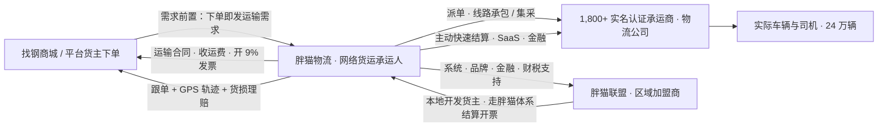
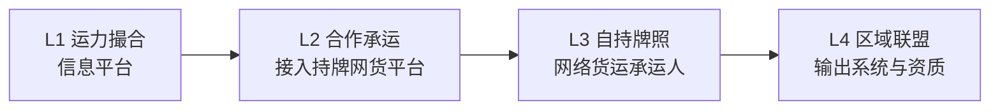

# 货袋子 · 物流板块介入路径分析：行业底座、监管框架、找钢网胖猫物流对标与分级介入方案（v0.1 待确认稿）

| 项目 | 说明 |
| --- | --- |
| 文档状态 | v0.1 · 待业务方确认 |
| 关联文档 | [加工服务产品设计方案](./processing-service-design-v0.1.md) · [AI 接入与市场价值](./processing-service-ai-and-market-analysis-v0.1.md) · [权益保障、平台责任与找钢网加工对标](./processing-service-rights-risk-and-benchmark-v0.1.md) |
| 本稿回答的问题 | ① 胖猫联盟加盟模式到底怎么运营；② 找钢网胖猫物流整体如何运作、有什么可借鉴；③ 物流监管风险究竟是什么；④ 货袋子有大量现货订单但没有物流，应该怎么介入 |
| 资料口径 | 找钢网集团 2025 年度业绩公告（港交所）、胖猫物流官网、中国物流与采购网无车承运人案例（2019）、2024/2025 年胖猫物流承运商与合作伙伴大会公开报道、交通运输部《网络货运承运平台经营管理办法》（交运规〔2026〕1 号）及官方解读 |
| 免责说明 | 监管条款引用用于产品与商业设计参考，正式合规方案需律师与税务师审核 |

---

## 0. 结论先行

1. **货袋子每一笔现货订单背后都有一段运输，运输需求已经存在，只是目前流失给线下信息部和熟车。** 物流不是"要不要做"，而是"以什么身份做、做到哪一档"。
2. **监管风险的本质是"身份"问题。** 2026 年 1 月新发布的《网络货运承运平台经营管理办法》把"以承运人身份签运输合同、承担承运人责任"的平台纳入许可与税务双重强监管；而"只做信息撮合、不签运输合同、不收运费"的撮合平台，监管"另行规定"，目前按电商法等一般规则管理。**风险最大的不是运输本身，而是承运人责任、税务虚开、资金二清三件事，它们都只在平台成为承运人或代收运费时才出现。**
3. **建议货袋子走"先撮合、后合作承运、再自持牌照、最后联盟输出"的四档路径**：一期做运力撮合（L1），把现货订单一键变成运输需求；二期与持牌网络货运平台合作解决发票和承运人责任（L2）；三期在月撮合吨位与线路稳定后自持网络货运牌照（L3）；远期向区域车队输出系统与资质，即胖猫联盟式的区域联盟（L4）。
4. **胖猫物流的本质**：以网络货运承运人身份承接找钢商城和平台货主的运输，匹配给 1,800 多家实名认证的物流公司（不是零散司机）执行，靠"透明价格 + 安全交付"（跟单 + GPS + 货损理赔）留住货主，靠"货源多、结算快"留住承运商；2017 年起用"固定线路集采招标 / 线路承包"换稳定低价；2025 年推出"胖猫联盟"，向区域中小物流企业和个体经营者输出标准化运营体系、系统、供应链金融、品牌授牌和合规财税支持，让他们在本地开发货主并走胖猫体系结算开票，Q4 已覆盖 100 城、190 家加盟商、季度 44 万吨，外部（非找钢）货源占比过半。它 2025 年物流收入超 4.8 亿元、毛利约 2,950 万元、吨位近 800 万吨，**折合每吨收入约 60 元、毛利不到 4 元，毛利率约 6%**——物流单靠差价不赚钱，靠的是货源、规模、金融与数据。
5. **最值得借鉴的六件事**：货源先行、需求前置（下单即发运输需求）、先撮合后承运、以承运商（物流公司）而非司机为对象、线路集采换稳定、结算快与跟单赔付并重。**最需要避开的三件事**：过早成为承运人、依赖地方财政返还的税务模型、自营金融。

---

## 第一部分 · 钢材物流行业底座（20 年物流规划师视角）

### 1. 钢材公路物流的特点

| 特征 | 说明 | 对产品设计的影响 |
| --- | --- | --- |
| 重货、短驳为主 | 仓库 → 工厂/工地，主流运距 50～300 公里；长距离走水运（长江、沿海）或铁路到仓 | 车货匹配是"区域内高频短驳"，线路集中度高，适合线路集采 |
| 车型专业 | 13 米、17.5 米平板/半挂为主，卷板需鞍座，长材需长板，薄板怕雨需篷布 | 需求单必须带规格（长度、卷/板/型材）自动映射车型 |
| 单车货值高 | 一车 30～35 吨 × 3,500～4,500 元/吨 ≈ 10～15 万元 | 骗货、丢货、少货是核心风险；实名、轨迹、回单、保险缺一不可 |
| 装卸依赖仓库 | 行车/吊机装卸，过磅出磅单，提货凭证（提单/出库码）交接 | 节点要覆盖"到仓、装车、过磅、出库、到达、卸货、签收" |
| 时效敏感 | 工地、工厂等料，"今天下单明天到"是常态 | 承运商响应速度是核心指标 |
| 计价方式 | 元/吨为主，也有元/车；装卸费、吊装费、等待费、多点装卸加价、回单费另计 | 报价必须结构化并明确含/不含项 |
| 超载历史 | 治超前普遍超载，治超后合规载重（六轴 49 吨总重）成本上升 | 平台不得指使超载，报价按合规吨位 |
| 发票刚需 | 货主（贸易商/工厂）需要 9% 运输服务发票抵扣进项，个体车主开不出票 | 这是网络货运平台存在的核心商业理由，也是税务风险的根源 |
| 返程空驶 | 单向货流明显（钢厂/大仓 → 消费地），返程空驶率高 | 平台有回程货源撮合的价值 |

### 2. 参与者与各自痛点

| 角色 | 是谁 | 痛点 |
| --- | --- | --- |
| 货主 | 买家（工厂、工地、贸易商）、卖家（贸易商送货） | 找车慢、价格不透明、司机放鸽子、少货丢货、回单慢、拿不到合规发票、多段运输协调累 |
| 承运商 | 区域物流公司（自有 + 挂靠车辆，5～200 台）、信息部（黄牛） | 货源不稳定、运费拖欠账期长、空驶、垫付油费路桥费、开票税负 |
| 司机 | 自有车个体、挂靠司机 | 在仓库等装货动辄半天、运费被层层克扣拖欠、事故责任 |
| 仓库 | 钢材仓库/加工中心 | 车辆集中到仓拥堵、提货凭证核验、装车安全 |
| 网络货运平台 | 持牌承运人平台 | 税务合规、承运人责任、司机权益监管、数据上报 |

### 3. 钢材物流的固有风险（无论谁做）

| 风险 | 说明 |
| --- | --- |
| 骗货 / 丢货 | 钢材易变现，冒名车辆提货后失联是行业经典风险；防范要靠"人车一致 + 提货码 + 轨迹 + 保险" |
| 货损 / 少货 | 雨淋锈蚀、捆扎散落、过磅差异；理计与过磅口径争议 |
| 交通事故 | 重载车事故后果严重；承运人对货物毁损灭失承担赔偿责任（《民法典》第 832 条），联运中与托运人签约的承运人对全程负责并与区段承运人连带（第 834 条） |
| 超限超载 | 行政处罚与事故连带；平台若"指使、强令"超载将被查处并纳入诚信监管 |
| 运费拖欠与司机权益 | 监管明确要求平台按约定及时向实际承运人结算运费，不得用算法规则收取不合理费用 |

---

## 第二部分 · 监管框架（以 2026 年 1 月新规为准）

### 4. 《网络货运承运平台经营管理办法》（交运规〔2026〕1 号）要点

交通运输部与国家税务总局于 2026 年 1 月 23 日印发，取代 2019 年《网络平台道路货物运输经营管理暂行办法》，取消施行期限、长期有效。

| 条款 | 要求 | 对货袋子的含义 |
| --- | --- | --- |
| 第 2 条 定义 | 网络货运承运平台 = 依托互联网整合运输资源，**以承运人身份与托运人签订运输合同**，委托实际承运人完成运输，**承担承运人责任** | 只要平台签运输合同、收运费、开运输发票，就是承运人，进入本办法监管 |
| 第 6～7 条 许可 | 需《道路运输经营许可证》（经营范围：网络货运承运平台经营）+ 经营性互联网信息服务要求 + 信息交互处理与全程跟踪记录的线上服务能力 | 需要牌照、ICP 许可与省级线上服务能力认定 |
| 第 8 条 安全生产 | 建立安全生产管理制度、从业人员安全教育培训 | 需要安全管理体系与人员 |
| 第 10 条 资质审查 | 审查车辆道路运输证、驾驶员从业资格证（4.5 吨以下普通货车除外）；线上线下人车一致；不得超越实际承运人经营范围 | 承运商与车辆、司机准入是硬要求 |
| 第 11、18 条 真实性 | 不得虚构交易相互委托；对运输、交易全过程实时监控，不得虚构交易、运输、结算信息 | 轨迹、资金、运单必须真实对应 |
| 第 12 条 结算 | 按合同约定及时向实际承运人结算运费 | 平台要有运费垫付/结算能力与资金 |
| 第 13 条 装载 | 不得指使或强令超载超限 | 报价与派单按合规吨位 |
| 第 14、23 条 数据上报 | 按技术规范上传单证信息至省级网络货运信息监测系统，省级与税务共享，差异化监管 | 系统对接监管平台是刚性投入 |
| 第 15 条 保险 | 鼓励采取承运人责任保险等措施 | 实操上必须投保 |
| 第 17 条 规则 | 制定交易规则和服务协议，明确进入退出、权益保护；不得利用数据算法规则收取不合理费用；建立承运人评价体系并公示；投诉举报与在线争议机制 | 与电商法要求同向 |
| 第 18 条 留存 | 注册、认证、服务、交易信息保存不少于 3 年；涉税资料保存 10 年；交易信息含订单日志、结算、含时间与位置的实时轨迹 | 数据存储与合规成本 |
| 第 19～20 条 税务 | 依法抵扣进项、不得虚开；平台与实际承运人均依法纳税；平台按规定履行代办税费申报缴纳义务 | 代开代缴是义务也是风险源 |
| 第 22 条 数据保密 | 未经同意不得泄露、出售司机车辆托运人信息，不得用相关信息开展其他业务 | 物流数据与现货数据的融合使用需授权设计 |
| 第 24～25 条 处罚 | 虚开虚抵按税收征管法处理、涉嫌犯罪移送司法；委托无资质承运人、承运禁运品、指使超载造成重大事故纳入诚信监管 | 高压线 |
| **第 31 条** | **从事网络货运信息交易撮合的网络货运撮合平台，其经营管理另行规定** | **撮合平台目前不在本办法许可范围内，按电商法、ICP 等一般规定管理；后续会有专门规定，存在政策不确定性** |

### 5. 两种身份的对照

| 维度 | 网络货运**承运**平台 | 网络货运**撮合**平台 |
| --- | --- | --- |
| 法律角色 | 承运人，与托运人签运输合同 | 信息服务提供者，货主与承运商直接签约 |
| 许可 | 道路运输经营许可证（网络货运）+ ICP + 线上服务能力认定 + 监测系统对接 | ICP 经营许可（现货平台通常已有）；专门规定待出台 |
| 收入 | 运费差价（向货主收、向承运商付） | 信息服务费 / 会员费 / 增值分成 |
| 开票 | 向货主开 9% 运输服务发票；进项来自承运商发票、司机代开、合规油费路桥费 | 只能开 6% 信息技术服务费发票，**不能解决货主的运输发票需求** |
| 承运人责任 | 货损、丢货、事故对货主负第一责任，再向实际承运人追偿 | 不承担，靠规则、保险、争议机制 |
| 资金 | 运费是自身营业收入，合法收付；需垫付与结算能力 | **不得代收代付运费**（否则触碰无证清算），或走持牌支付托管 |
| 税务风险 | 虚开、虚抵、代开滥用是行业重灾区；进项缺口常依赖地方财政返还，政策收紧后模型脆弱 | 低 |
| 司机权益监管 | 直接适用（及时结算、算法规则、安全培训） | 间接 |
| 数据上报 | 强制 | 暂无 |
| 建设与运营成本 | 高：牌照、系统对接、调度跟单结算税务合规团队、垫资 | 低 |

**判断**：货袋子当前没有物流团队、没有牌照、没有运费垫付资金，直接做承运平台既不现实也不必要；但纯撮合解决不了货主"要发票、要有人负责"这两个刚需。所以中间需要一个"合作承运"的过渡档。

### 6. 其他相关合规点

| 事项 | 说明 |
| --- | --- |
| 保险中介 | 平台若"销售"货运险并收取佣金，涉及保险兼业代理资质；建议与保险经纪公司合作，平台只做入口与数据对接 |
| 二清 | 撮合模式下运费必须货主直付承运商，或经持牌支付机构/银行存管分账 |
| 数据合规 | 轨迹是含位置的个人/企业敏感信息，收集需司机授权，与现货数据融合需在协议中明确 |
| 电商法 | 准入核验、信息保存、规则公示、争议机制等义务同样适用（详见权益保障文档第 6 章） |

---

## 第三部分 · 找钢网胖猫物流运作解析

### 7. 发展脉络

| 时间 | 事件 | 含义 |
| --- | --- | --- |
| 2014 | 胖猫物流成立（找钢网全资子公司） | 从找钢商城的运输需求切入 |
| 2015 | 创始人称"客户仅 7% 有自有车辆，93% 要找车比价"，做"类罗宾逊"车货匹配，团队 90 人 | **先做撮合/匹配**，不是一上来就当承运人 |
| 2017 | 推出"承运商伙伴计划"：固定线路集采招标，中标承运商独占货量、货源稳定、享受灵活付款与金融服务，须执行胖猫服务标准；上海—常州线路承运商日均货量增至 5 倍 | **线路集采换稳定低价与服务标准** |
| 2017—2018 | 连续入选交通部无车承运人试点 | 转为承运人身份 |
| 2019 | "白龙马"TMS 与找钢商城系统无缝对接，客户买货前/买货中即可发布运输需求；年获超 1,500 万吨货源与客户预付费运输业务，共享给承运商 | **需求前置 + 货源共享** |
| 2020 | 取得网络货运平台资质、4A 级；42 家分站、1,306 家承运商 | 持牌运营 |
| 2021 | 向承运商输出 SaaS（管车、派单、理财），承运商反馈"货源多、结算快、主动结算" | **结算快是承运商留存的第一因素** |
| 2024 | 线路承包制：优势线路承包给资质、实力、服务更优的承运商，首批 8 家；承诺"不放鸽子、不水单、不拖欠运费，不允许少货偷货" | 供给治理升级 |
| 2025 | 推出"胖猫联盟"；Q4 覆盖 100 城、签约 190 家加盟商、季度 44 万吨；12 月外部业务占比 52%；计划 AI 智能运力池覆盖全国 95% 主要线路 | **向区域输出能力，货源不再只靠找钢** |

### 8. 运作模式拆解

| 要素 | 胖猫做法 |
| --- | --- |
| 身份 | 网络货运承运人：向货主签合同收运费开票，向承运商付运费 |
| 供给对象 | **物流公司（承运商）而不是零散司机**：实名认证、准入、评分、淘汰；车辆资质由 AI 风控审查（2025 年审查近 14 万次车辆资质、监管超 61 万次轨迹） |
| 需求来源 | 找钢商城与平台买家为主（2025 年 12 月外部业务已过半） |
| 定价 | "透明价格"：线路集采/承包形成基准价，一单一议减少 |
| 服务 | 汽运、水运、水陆联运、专线、小吨位拼车、多装多卸配送；专业跟单 + GPS；货损理赔；仓储加工一票统结 |
| 承运商价值 | 货源多、结算快主动结算、SaaS 工具、金融服务、稀缺线路独占 |
| 经济性 | 2025 年收入 > 4.8 亿元、毛利约 2,950 万元、吨位近 800 万吨：**约 60 元/吨收入、不到 4 元/吨毛利、毛利率约 6%** |
| 组织 | 40 余家分站（本地调度、跟单、承运商开发）+ 总部系统与结算 |

### 9. 胖猫联盟是怎么运营的

公开资料给出了联盟的定位、供给内容与规模，**没有公开加盟费、分成比例与具体合同条款**，以下基于公开信息与行业通行做法梳理：

| 维度 | 内容 |
| --- | --- |
| 对象 | 区域中小物流企业与个体经营者（有本地车队和本地货主关系，但缺系统、缺合规开票能力、缺资金、缺品牌） |
| 找钢输出 | ① 标准化运营体系（服务标准、SOP）；② 智能化系统（TMS、轨迹、结算）；③ 供应链金融（运费垫付/账期类服务）；④ 品牌赋能（"胖猫联盟"授牌，共同开发区域市场）；⑤ 合规财税支持（借助胖猫的网络货运资质完成合规开票与税务处理） |
| 加盟商贡献 | 本地货源开发（这就是"外部业务占比 52%"的来源）、本地运力组织、本地跟单与服务 |
| 业务流 | 加盟商开发的货主订单进入胖猫系统，由胖猫作为承运人签约开票结算，运力由加盟商组织；找钢获得吨位、资金流水与服务费/差价，加盟商获得合规能力、系统、金融与品牌 |
| 本质 | **"持牌网络货运平台 + 区域运营加盟"**：把牌照、系统、资金、品牌集中在总部，把本地化的货主开发、运力组织、跟单服务下沉给区域伙伴。这与满帮、传化等平台的区域服务商/城市合伙人模式同源 |
| 对找钢的意义 | 在自身钢铁交易吨量波动（2024 年停胖猫白条后交易量下滑）的背景下，用联盟把物流从"服务找钢商城"变成"服务全行业"，2025 年物流收入增长 19%、吨位增长 15% |
| 风险点 | 加盟商开发的外部货源真实性与合规性由总部承担（虚开、人车不一致的连带风险）；对加盟商的服务质量管控依赖标准与系统 |

### 10. 对货袋子的借鉴与警示

| 借鉴 | 具体动作 |
| --- | --- |
| 货源先行 | 胖猫 2019 年就有 1,500 万吨/年货源再谈承运商；货袋子先把现货订单的运输需求线上化、量化，用货源换承运商 |
| 需求前置 | 现货下单页/订单页一键"发布运输需求"，买货时就找车 |
| 先撮合后承运 | 胖猫 2014—2017 是匹配，2017 才试点承运人；货袋子一期做撮合 |
| 以承运商为对象 | 招募区域物流公司而非零散司机，管理与合规成本低一个量级 |
| 线路集采/承包 | 用现货订单数据找出 TOP 线路，对优质承运商定线路、定基准价、定服务标准 |
| 结算快 + 跟单赔付 | 对承运商"结算快"、对货主"有人跟、有赔付"是两端留存的核心 |
| 联盟做区域 | 当自持牌照后，用联盟把系统与资质输出给区域车队，引入非平台货源 |
| **警示 1** | 物流毛利约 6%、每吨不到 4 元，靠差价养不活团队；价值在于提升现货成交、沉淀数据、带动金融与保险 |
| **警示 2** | 网络货运税务模型对地方财政返还依赖高，2024—2025 年多地清理返还政策，靠返还赚钱的平台大批退出；货袋子若自持牌照必须按"真实业务 + 合规进项"设计，不以返还为收入 |
| **警示 3** | 找钢自营金融（胖猫白条）2024 年停摆并导致交易量下滑；物流金融只做与金融机构合作的场景输出 |

---

## 第四部分 · 货袋子物流介入方案

### 11. 现状判断

- 现货平台已有大量订单，每笔订单天然对应"仓库 → 收货地"的运输，且未来加工板块会新增"仓库 → 加工厂 → 收货地"的多段运输。
- 目前运输环节完全在线下完成：买家自己找熟车、卖家送货、信息部撮合。平台既没有沉淀数据，也没有服务，更没有收入。
- 货袋子没有物流团队、牌照与垫资能力，但有货源、有用户、有企业认证与订单数据，这恰恰是胖猫物流起步时最值钱的东西。

### 12. 四档介入模式

| 维度 | L1 运力撮合 | L2 合作承运 | L3 自持牌照 | L4 区域联盟 |
| --- | --- | --- | --- | --- |
| 平台身份 | 信息服务方 | 信息服务方 + 合作网货平台为承运人 | 承运人 | 承运人 + 联盟总部 |
| 合同 | 货主与承运商直签（平台电子协议模板） | 需要发票/责任的订单流转给合作网货平台，由其与货主签约 | 平台与货主签、与承运商签 | 同 L3，加盟商组织运力 |
| 运费 | 货主直付承运商，平台不经手 | 货主付合作网货平台 | 货主付平台 | 货主付平台 |
| 发票 | 承运商自开或不开；平台开信息服务费票 | 合作网货平台开 9% 运输发票 | 平台开 9% 运输发票 | 同 L3 |
| 责任 | 规则、保险、争议机制 | 合作网货平台承担承运人责任 | 平台承担承运人责任 | 同 L3 |
| 许可 | ICP（已有）；撮合平台专门规定待出台 | 同 L1；合作方持牌 | 道路运输经营许可（网货）+ 线上服务能力认定 + 监测系统对接 | 同 L3 |
| 收入 | 信息服务费（承运商付，每单固定或运费 1%～2%）/ 会员 / 保险与金融导流分成 | 合作方支付技术服务费或分成（行业常见 1%～3% 运费） | 运费差价 3%～8% + 增值（保险、油卡、ETC、金融导流） | 加盟费/系统费 + 分成 |
| 主要风险 | 骗货与货损纠纷的声誉风险；二清（必须不碰运费）；政策不确定 | 合作方合规质量（虚开、人车不一致）牵连声誉；数据归属 | 承运人责任、税务、垫资、司机权益、数据上报 | 加盟商外部货源真实性 |
| 需要的能力 | 产品 + 少量运营（承运商招募审核） | + 商务与系统对接 | + 物流子公司：调度、跟单、结算、税务、合规、安全、客服，资本 | + 区域拓展与加盟管理 |
| 建议阶段 | **一期，立即** | **二期** | 三期，达到触发条件后 | 远期 |

### 13. 分阶段推进与升级触发条件

| 阶段 | 目标 | 升级到下一档的触发条件（建议） |
| --- | --- | --- |
| L1 运力撮合 | 把现货订单的运输需求线上化；招募首批区域承运商；跑出 TOP 线路与基准价；沉淀轨迹与回单 | 月撮合吨位 ≥ 2～3 万吨；≥ 30% 货主明确要求运输发票或平台责任；TOP 20 线路占比 ≥ 60% |
| L2 合作承运 | 用合作网货平台补齐发票与承运人责任；平台不碰运费与牌照 | 月经合作方承运吨位 ≥ 5～10 万吨且稳定 6 个月；合作方分成收入无法覆盖数据与体验损失；具备物流子公司组建条件 |
| L3 自持牌照 | 在 1 个省申请网络货运许可，先承接 TOP 线路；建立承运商责任险、结算与税务体系 | 月吨位 ≥ 20 万吨，多省货源；系统与合规体系成熟 |
| L4 区域联盟 | 向区域车队输出系统与资质，引入非平台货源 | — |

**核心原则**：每一档只在上一档的数据证明"需求存在且付费意愿成立"后才升级；L3 之前平台不做承运人、不碰运费、不开运输发票。

### 14. 一期 L1 产品设计概要

#### 14.1 需求侧（货主）

| 功能 | 说明 |
| --- | --- |
| 一键发布运输需求 | 从现货订单/加工订单自动带入：提货仓库（地址、联系人、装车时间窗）、收货地、品名规格（自动映射车型：卷板需鞍座、长材需 13/17.5 米板、薄板需篷布）、吨位、件数、是否需过磅、装卸要求、期望到达时间、是否需要发票（勾选则提示二期合作承运通道） |
| 多段运输 | 支持"仓库 → 加工厂 → 收货地"两段需求一次发布，与加工订单联动 |
| 报价对比 | 承运商结构化报价：元/吨或元/车、含/不含装卸与等待、预计到仓时间、车辆类型、保险情况；系统按线路历史价给参考区间 |
| 拼车 | 小吨位（< 10 吨）同仓库同方向需求自动提示拼车，与加工拼单逻辑复用 |
| 全程节点 | 接单 → 车辆信息（车牌、司机、手机）→ 到仓签到 → 装车/过磅（磅单照片）→ 出库 → 在途轨迹 → 到达 → 卸货 → 签收回单拍照 |
| 提货防骗 | 提货码/电子提单仅在货主确认承运商后发放给指定车牌与司机；仓库核验人车一致 |
| 保险入口 | 与保险经纪合作提供按单货运险一键投保（货主或承运商投保），平台不收保费不做代理 |
| 异常与争议 | 等待超时、偏航、滞留、货损少货申报；争议流程复用加工板块规则 |
| 评价 | 准时、货损、服务、回单及时性 |

#### 14.2 供给侧（承运商）

| 功能 | 说明 |
| --- | --- |
| 准入 | 营业执照、道路运输经营许可证、车辆道路运输证、司机从业资格证、车辆保险、承运人责任险（鼓励）；对接第三方车辆与从业资格核验 |
| 运力档案 | 车型车数、常跑线路、服务城市、装备（鞍座、篷布、绑带）、可否多点装卸 |
| 需求大厅与定向推送 | 按常跑线路推送；报价；抢单 |
| 司机端 | 微信小程序：接单、签到、拍照、授权定位上传轨迹、回单 |
| 结算记录 | 货主直付，平台记录应收应付与支付状态，提供对账单；不代收代付 |
| 信用 | 准时率、货损率、回单及时率、放鸽子次数；影响推送与线路优先权 |

#### 14.3 运营侧

| 功能 | 说明 |
| --- | --- |
| 线路与价格 | 基于现货订单数据生成 TOP 线路、吨位、频次；维护线路参考价 |
| 承运商治理 | 准入审核、抽查、评分、淘汰；重大异常（骗货、事故）处置 SOP |
| 争议仲裁 | 复用加工板块仲裁工作台 |
| 数据看板 | 需求量、响应时长、成交率、准时率、货损率、发票需求比例（决定升级时点） |

#### 14.4 L1 的商业化

- 承运商侧：每单固定信息服务费（如 20～50 元）或运费 1%～2%，认证会员减免；一期可对首批承运商免费换供给。
- 货主侧：免费，用物流体验拉动现货转化与复购。
- 增值：保险经纪分成、后续油卡/ETC/金融导流。
- 考核口径：与加工板块一致，纳入"物流带动的现货 GMV"。

### 15. 二期 L2 合作承运的关键设计

- 选 1～2 家大宗类持牌网络货运平台合作（重点考察其税务合规记录、监测系统对接、承运人责任险、钢材线路经验），签订技术服务与数据协议。
- 订单分流：货主勾选"需要运输发票/平台承运"的需求进入合作通道，由合作方作为承运人签约、开票、结算、赔付；货袋子提供货源、承运商推荐、轨迹与节点数据。
- 数据与体验：节点信息回传货袋子，货主在货袋子内看到全程；合作方不得利用数据开展其他业务（对应新规第 22 条）。
- 收入：合作方支付技术服务费或按运费分成。
- 退出机制：数据可迁移，为 L3 自持牌照预留。

### 16. 三期 L3 自持牌照的准备清单

| 事项 | 内容 |
| --- | --- |
| 主体 | 设立物流子公司，隔离风险 |
| 许可 | 道路运输经营许可证（网络货运承运平台经营）、ICP、省级线上服务能力认定、省级监测系统对接 |
| 系统 | TMS、运单/资金/轨迹三流一致、监管上报、发票与代开代缴、承运商结算 |
| 保险 | 承运人责任险、货运险合作 |
| 团队 | 调度、跟单、承运商开发、结算、税务、合规安全、客服 |
| 资本 | 运费垫付周转金（按月吨位 × 单价 × 账期估算） |
| 税务模型 | 以真实业务与合规进项（承运商发票、司机代开、油费路桥费）为基础，不以地方返还为收入假设 |
| 安全 | 安全生产制度、从业人员培训、禁运品与超载控制 |

### 17. 风险清单（按档位）

| 风险 | L1 | L2 | L3/L4 | 对策 |
| --- | --- | --- | --- | --- |
| 骗货 / 冒名提货 | 声誉 | 声誉 | 直接赔付 | 人车一致核验、提货码、仓库核验、轨迹、保险 |
| 货损少货纠纷 | 声誉 | 合作方承担 | 直接赔付 | 磅单、装车/卸货照片、争议规则、保险 |
| 交通事故连带 | 低 | 合作方 | 承运人责任 | 承运人责任险、资质审查、不指使超载 |
| 税务虚开牵连 | 低 | 合作方合规是关键 | 高 | 选择合作方时尽调；L3 三流一致、不做返还依赖 |
| 二清 | 不碰运费即无 | 无 | 无（自身收入） | L1/L2 严格不代收代付 |
| 司机权益与算法监管 | 低 | 合作方 | 直接适用 | 及时结算、规则透明 |
| 撮合平台政策不确定 | 中 | 中 | — | 关注"另行规定"出台，预留合规改造 |
| 数据合规 | 中 | 中 | 高 | 授权、最小化、分级、不跨业务滥用 |
| 供给冷启动 | 高 | 中 | 中 | 用 TOP 线路货源定向招募，首批免费 |
| 投入回报 | 低 | 低 | 高 | 触发条件达成后再升级 |

### 18. 与现货、加工板块的协同

- 现货订单 → 运输需求（仓库 → 收货地）；加工订单 → 两段运输（仓库 → 加工厂 → 收货地），库内加工可省一段。
- 加工拼单 + 物流拼车：同加工商、同方向的子订单拼车，运费按重量占比分摊。
- 统一账户、企业认证、信用分、消息、争议仲裁、AI 能力（需求结构化、轨迹异常识别、线路价格参考）。
- 数据飞轮：订单 → 运输需求 → 线路与价格 → 更准的运费参考与匹配 → 更高的现货转化。

---

## 19. 需要您确认的事项

| # | 事项 | 建议 |
| --- | --- | --- |
| 1 | 是否按 L1 → L2 → L3 → L4 分档推进 | 是；一期只做 L1 运力撮合 |
| 2 | L1 是否坚持"平台不碰运费、不开运输发票、不签运输合同" | 是，这是一期规避承运人责任、税务与二清风险的底线 |
| 3 | 一期承运商招募对象 | 区域物流公司为主，不直接面向零散司机 |
| 4 | 首批试点城市与线路 | 用现货订单数据选 1～2 个城市的 TOP 10 线路 |
| 5 | 是否在一期即接入保险经纪提供按单货运险 | 是，平台只做入口不做代理 |
| 6 | L2 合作网货平台的选择标准与尽调 | 税务合规记录、监测系统对接、承运人责任险、钢材经验、数据协议 |
| 7 | L3 升级触发条件 | 月吨位 ≥ 5～10 万吨且稳定 6 个月、发票需求占比高、具备子公司组建条件 |
| 8 | 物流板块考核口径 | 纳入"物流带动的现货 GMV"，不以运费差价单独考核 |
