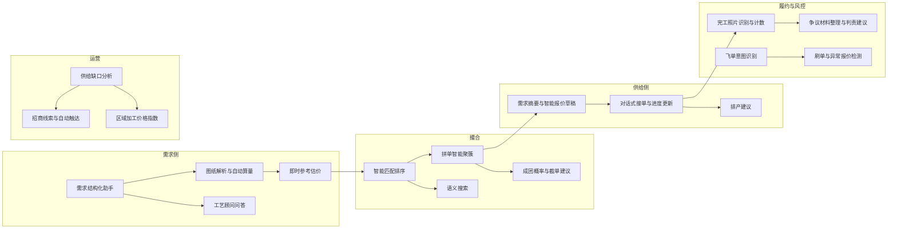
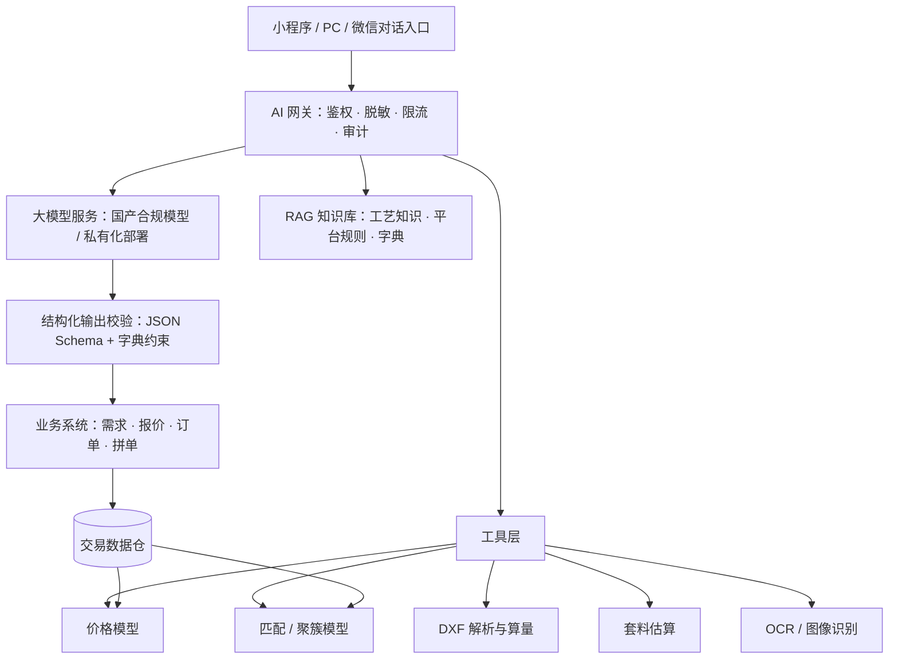

# 货袋子 · 加工服务板块 AI 接入方案与市场价值评估（v0.1 待确认稿）

| 项目 | 说明 |
| --- | --- |
| 文档状态 | v0.1 · 待业务方确认 |
| 上游文档 | [加工服务板块产品设计方案 v0.1](./processing-service-design-v0.1.md) |
| 本稿回答的问题 | ① AI 应该怎么接入、能提供什么价值；② 加工撮合板块是否有市场价值、是否"碾压"线下模式、对双方是否不可或缺 |

---

## 0. 结论先行

**关于 AI**

- AI 在这个板块的正确位置是**"把非标变标准、把慢变快、把人盯变系统盯"**，而不是替人做决定。最有价值的五个落点：需求结构化（说人话 → 需求单）、图纸自动算量与即时估价、拼单智能聚簇、工艺顾问问答、飞单/风控识别。
- AI 的价值上限取决于**平台沉淀的结构化交易数据**，没有数据的 AI 只是聊天框。因此 AI 方案必须和"结构化需求/报价/订单"的产品设计绑在一起：一期用 AI 降低结构化门槛，二期用结构化数据反哺 AI。
- 一期建议只做**成本低、价值直接、有人工兜底**的五项，其余分二、三期。

**关于市场价值**

- **有价值，值得做，但要放对位置。** 加工撮合费本身不是大生意（加工费绝对值低、费率有上限），它的核心价值是：① 拼单和一站式带来的**线下做不到的增量**；② 拉动现货成交与复购（真正的钱在这里）；③ 沉淀"谁能做、多少钱、做得怎样"的行业数据，支撑后续金融、物流、指数等增值业务。
- **不会全面"碾压"线下，也不应该以此为目标。** 大客户与固定加工商的熟人合作，线下模式在信任、账期、非标沟通上依然更强，平台在这类场景是**补充工具**（留痕、担保、进度）。但在四个场景平台具有结构性优势：**小批量长尾、异地找厂、拼单、买料 + 加工一站式**，其中拼单和跨区域产能余量变现是线下**根本做不到**的。
- **对双方的"不可或缺"必须靠每一单持续交付的价值，而不是"介绍认识"。** 对需求方是"拼得到、找得到、估得准、有保障"；对加工商是"闲置产能变现（边际成本接近零的纯利润）、陌生客户敢接、获客不靠关系"。

---

## 第一部分 · AI 接入方案

### 1. AI 的定位与原则

| 原则 | 说明 |
| --- | --- |
| 助手而非裁判 | AI 生成草稿（需求单、报价、判责建议），人确认后生效；任何涉及金额、交期、责任的动作都要有人点确认 |
| 结构化优先 | AI 的第一任务是把自然语言、照片、图纸、Excel 变成平台的结构化数据，这是所有后续智能的前提 |
| 传统算法与大模型分工 | 图纸解析、套料、匹配打分、价格模型用确定性算法/传统 ML；理解、生成、问答用大模型。不要用大模型算尺寸 |
| 数据飞轮 | 每一单结构化成交 → 价格模型更准 → 估价更可信 → 更多人在线下单 → 数据更多 |
| 合规与隐私 | 图纸和客户信息不得未经授权外送公有模型；优先国产合规模型或私有化部署；AI 生成内容按规定标识 |

### 2. AI 能力地图（按业务链路）

### 3. 各能力详细说明

#### 3.1 需求结构化助手（一期 · 最高优先级）

- **场景**：买家在输入框里说"给我把这 20 吨 3.0 的热卷开成 1250×6000 的板，下周三要，送到江宁"，或者直接粘贴微信聊天记录、拍一张手写单/磅单/质保书照片、上传 Excel 清单。
- **AI 做什么**：抽取工艺、材质、厚度、宽度、定尺、数量、交期、交付地、材料来源，自动填入对应工艺模板；缺失字段用一句话追问；识别"开平""开板""落料"等方言与行话并归一到字典。
- **价值**：需求发布时间从约 10 分钟降到 1 分钟以内；加工商拿到的每一张需求单都是可直接报价的结构化单；这是解决"需求描述不清"这个双方共同痛点的根本手段。
- **实现**：大模型 + 工艺参数字典约束输出（JSON Schema）+ OCR/多模态识别；置信度低的字段标黄让用户确认。

#### 3.2 图纸解析与自动算量（一期做 DXF，二期做 PDF/图片）

- **场景**：切割类需求上传 DXF/DWG 图纸。
- **AI/算法做什么**：解析闭合轮廓，计算切割总长度、穿孔数、零件外接尺寸、单件面积；按板幅估算整板利用率（简单套料启发式算法）；PDF/图片图纸用视觉模型识别标注尺寸并提示人工核对。
- **价值**：加工商不用再打开 CAD 一个个量；需求方在发布瞬间就能看到"约 320 米切割、86 个穿孔、预计用 2.3 张 1500×6000 板"；这是即时估价和拼单套料的基础。
- **实现**：DXF 用确定性解析库（非大模型）；PDF/图片走多模态模型 + 人工确认。

#### 3.3 即时参考估价（一期给区间，二期给点估）

- **场景**：需求发布完成时、加工商报价时、拼单发起时。
- **AI 做什么**：基于同工艺、同材质厚度档、同区域的历史报价与成交价，结合当期钢价、数量档位、交期紧急度，给出参考价区间；报价明显偏离时给双方提示。
- **价值**：需求方发布即知道大概要花多少钱（决定了会不会继续用平台）；加工商报价有锚点，减少来回；恶意低价（线下再加价）和虚高报价被识别。
- **实现**：一期数据少时用规则 + 运营录入的区域参考价表 + 少量 ML；二期用回归/树模型；对外表述永远是"参考价"，不替代加工商报价。

#### 3.4 工艺顾问问答（一期）

- **场景**："10mm Q235B 切 200 个法兰盘用火焰还是激光？""不锈钢开平会不会划伤？""2.0 的镀锌板折弯最小内径多少？""我这批料要不要先校平？"
- **AI 做什么**：基于工艺知识库（工艺适用范围、公差常识、材质特性、常见质量问题、平台规则）做 RAG 问答；在需求发布过程中主动提示（"8mm 以下建议激光/等离子，火焰切割热变形大"）。
- **价值**：帮不懂加工的小买家把需求提对，减少"提错工艺 → 报错价 → 出争议"的链条；把 20 年加工经验产品化，成为平台的差异化口碑。
- **实现**：知识库由业务方（您）+ 首批加工商共建，大模型 RAG；回答附带来源；涉及安全/结构件承载等敏感问题一律提示咨询专业人员。

#### 3.5 智能匹配排序（一期规则，二期模型）

- 一期沿用设计方案中的加权规则；二期用历史数据训练"该加工商对该需求报价并成交的概率"模型，加入产能日历、响应习惯、需求方偏好等特征；对新加工商保留探索流量。

#### 3.6 拼单智能聚簇（二期 · 拼单板块的核心 AI）

- **场景**：系统持续扫描所有"愿意拼单"的需求与加工商发布的"余量档期"。
- **AI 做什么**：按拼单键（材质 + 厚度 + 卷宽/板幅 + 区域）聚簇，结合交期窗口重叠、地理邻近、加工商能力，主动生成"可拼组合"并推送："您的 2 吨 Q235B 3.0 开平需求，附近有 3 个同规格需求（合计 6.5 吨）和 1 家加工商周三有余量，是否发起拼单？"；对切割类做跨订单套料估算，给出拼单后各方成本下降幅度；预测成团概率并建议阈值与截单时间。
- **价值**：线下根本无法完成的"陌生人之间的产能聚合"，是本板块最不可替代的价值点；把"等人来拼"变成"系统主动凑"，直接决定成团率。
- **实现**：规则聚簇 + 套料启发式 + 成团概率模型；推送策略要控频，避免打扰。

#### 3.7 加工商侧助手（二期）

- **需求摘要**：把结构化需求 + 图纸算量结果压成一句话推送给加工商微信："江宁 20 吨 Q235B 3.0×1250 开平定尺 6000，下周三交，距您 12km，参考价 45～55 元/吨"。
- **智能报价草稿**：按加工商预设的价格规则（基础单价、厚度加价、数量折扣、起步费）自动生成报价单，加工商一键确认或微调。
- **对话式接单与进度更新**：加工商在微信里回复"接了""料到了""明天发货"，AI 解析为状态变更并写入订单，解决加工商"不愿意打开系统"的现实问题。
- **排产建议（三期）**：基于订单、设备、档期给出排产顺序建议，与轻量工单 SaaS 结合。

#### 3.8 履约质检与争议辅助（二期）

- **完工照片识别**：识别子订单标签是否齐全、按捆/按张粗计数、识别明显表面缺陷或标签错乱，提示加工商补拍或复核。
- **争议材料整理**：自动汇总订单快照、图纸版本、收料记录、完工记录、聊天记录，对照公差与余料约定生成"事实清单 + 规则依据 + 判责建议"，供仲裁人员参考；生成给双方的说明文案。
- **价值**：争议处理时长和人力显著下降，判责一致性提高。

#### 3.9 风控识别（一期做飞单意图，二期做刷单与异常）

- **飞单意图识别**：订单内聊天出现手机号、微信号、"私下谈""不走平台"等意图时提醒双方并记录；结合"多次报价后从不成交"等行为特征标记高风险加工商。
- **刷单与异常报价**：同企业多账号自成交、异常高频拼单、显著低于成本的报价等模式检测。

#### 3.10 运营与数据产品（二、三期）

- **供给缺口分析**：哪个城市哪种工艺需求多但报价少 → 自动生成招商线索并触达潜在加工商（结合现货侧带加工线的卖家）。
- **区域加工价格指数**：基于成交数据发布"开平/纵剪/切割区域价格指数"，形成行业影响力与内容获客。
- **语义搜索**："南京附近能切 30mm 不锈钢的"直接检索加工商与拼单。

### 4. 技术架构（概要）

- **模型选型**：优先国产合规大模型 API（成本低、合规），涉及图纸与客户数据的能力评估私有化部署；视觉/OCR 用成熟云服务。
- **人机协同**：所有 AI 输出带置信度，低置信度必须人工确认；AI 操作有独立审计日志。
- **成本控制**：需求结构化、问答按调用计费，单次成本可控；图纸解析用本地算法零边际成本；模型类能力二期再做。

### 5. AI 能力分期

| 阶段 | 能力 | 理由 |
| --- | --- | --- |
| 一期 | 需求结构化助手、DXF 解析算量、参考估价（区间）、工艺顾问问答、飞单意图识别 | 成本低、价值直接、不依赖大量历史数据、有人工兜底 |
| 二期 | 拼单智能聚簇与成团预测、智能报价草稿、对话式接单、完工照片识别、争议辅助、匹配模型、刷单检测、PDF/图片图纸识别 | 需要一期沉淀的结构化数据与用户习惯 |
| 三期 | 排产建议、跨订单套料优化、区域价格指数、供给缺口自动招商、语义搜索、ERP 直连智能下单 | 需要供给密度与数据规模 |

### 6. AI 价值衡量指标

| 指标 | 基线（无 AI） | 目标 |
| --- | --- | --- |
| 需求发布平均耗时 | 8～12 分钟 | ≤ 1.5 分钟 |
| 需求"可直接报价"比例 | 约 50% | ≥ 90% |
| 首个报价响应时长 | 数小时 | 即时参考价 + 1 小时内人工报价 |
| 拼单成团率 | 依赖人工撮合 | 二期较一期提升 50% 以上 |
| 争议平均处理时长 | 3～5 天 | ≤ 1.5 天 |
| 运营人力 / 百单 | — | 下降 50% 以上 |

### 7. AI 接入的边界与风险

- **不要让 AI 自动成交**：加工非标、责任重，AI 只到"草稿 + 建议"，成交必须人确认。
- **不要把图纸送进公有模型**：图纸是客户核心资产，要有明确授权与脱敏策略。
- **不要过度承诺"AI 报价"**：对外统一叫"参考价"，避免加工商反感与法律责任。
- **数据不足期的幻觉风险**：一期估价与问答都要标注依据、可追溯，运营定期抽检。
- **成本失控风险**：对高频调用（问答、结构化）设置配额与缓存。

---

## 第二部分 · 市场价值评估

### 8. 市场有多大（粗估，用于判断量级而非精确预测）

- 中国粗钢产量约 10 亿吨/年，表观消费约 9 亿吨/年；板带材占比约一半。板带材中相当比例在使用前需要一次加工（开平、纵剪、横切、剪切）；此外还有切割、折弯、镀锌等深加工。
- 初加工费按 30～150 元/吨、加工比例按 30%～50% 粗估，**仅板材初加工费市场约在百亿元/年量级**；加上切割、折弯、镀锌等深加工，整体加工服务市场在**数百亿至千亿元/年**量级。
- **对平台的现实意义**：这是一个足够大的行业，但撮合费率有天然上限。假设试点区域年撮合加工 GMV 2 亿元、综合费率 3%，撮合费收入约 600 万元。**撮合费可以覆盖板块运营成本、证明模式，但不是终局收入。**

### 9. 收入结构的正确预期

| 收入来源 | 量级判断 | 说明 |
| --- | --- | --- |
| 加工带动的现货增量成交 | **最大** | "买料 + 加工"一站式提升现货转化与复购，加工需求本身就是最精准的现货采购信号 |
| 增值服务：担保交易、物流、供应链金融 | 大 | 加工订单是天然的金融与物流场景（账期、运输、保理） |
| 拼单撮合费 | 中 | 付费意愿最强（需求方确实省了钱） |
| 成交撮合技术服务费 | 中 | 主体收费项，用来建立"在线成交 = 付费"的规则 |
| 加工商会员、推广位 | 中小 | 供给密度足够后才有价值 |
| 数据产品（价格指数） | 小但战略 | 行业影响力与获客 |

**结论**：把加工板块定位为**"现货平台的战略配套 + 拼单差异化"**，而不是一个独立靠撮合费养活的业务线。

### 10. 是否"碾压"线下模式：分场景说清楚

| 场景 | 线下熟人模式 | 大平台自营加工中心 | 货袋子开放撮合 + 拼单 | 判断 |
| --- | --- | --- | --- | --- |
| 大客户 + 固定加工商长期合作 | 强：信任、账期、品质稳定、非标当面谈 | 中 | 弱～中：作为留痕/担保/进度工具 | 平台是补充，不是替代 |
| 小批量、零散、临时需求 | 弱：被起订量卡住、找不到人、价格被宰 | 弱：自营中心不愿接小单 | **强**：长尾聚合、即时估价 | 平台优势明显 |
| 异地找加工（贸易商替下游在外地找厂） | 弱：没有关系网 | 中：仅覆盖自有城市 | **强**：跨区域供给库 + 信用 | 平台优势明显 |
| 拼单（陌生人之间聚合产能/整板/批次） | **做不到** | 做不到（自营不开放） | **独有** | 线下无法复制 |
| 买料 + 加工 + 送货一站式 | 弱：三方协调、多段物流 | 强（但只限自有资源） | **强**：现货 + 开放加工 + 库内加工 | 平台优势明显 |
| 加工商产能余量变现 | 弱：靠电话喊、靠关系 | 不适用 | **强**：余量拼单、定向推送 | 平台优势明显 |
| 价格发现 | 弱：不透明 | 中 | 强：参考价、比价 | 平台优势明显 |
| 履约保障与争议 | 弱：口头约定、难举证 | 强 | 强：快照、留痕、仲裁、担保 | 平台优势 |
| 高度非标、复杂结构件 | 强 | 中 | 弱 | 一期不碰 |

**诚实的判断**：

1. **平台不会也不需要全面碾压线下**。线下熟人模式最强的部分（信任、账期、面对面非标沟通）是几十年形成的，平台硬碰硬没有胜算，而且这部分用户即使用平台也倾向飞单。
2. **平台在四个场景有结构性优势**：小批量长尾、异地找厂、拼单、一站式。这四个场景的共同点是**信息不对称高、协调成本高、线下关系网失效**——这正是撮合平台的用武之地。
3. **拼单是唯一线下完全做不到的事**，也是本板块最应该讲透、做深的差异化。其它三个场景线下"能做但做得差"，平台是效率提升；拼单则是"从无到有"。
4. **国内大型钢铁电商平台普遍把加工配送做成自营/托管加工中心**，服务自己的大客户，对长尾加工商和小买家是不开放的。这既证明"加工是现货平台的必然延伸"，也留出了**开放式撮合 + 拼单**的差异化空间。

### 11. 对双方是否"不可或缺"

"不可或缺"的判定标准：**离开平台，这件事要么做不成，要么成本显著更高。**

#### 11.1 对需求方

| 价值 | 线下能否替代 | 强度 |
| --- | --- | --- |
| 拼单：小量拿到大单价、不被起订量卡住 | 不能 | 不可或缺 |
| 异地/陌生城市快速找到能做的厂 | 很难 | 强 |
| 发布即知参考价、多家比价 | 很难 | 强 |
| 买料 + 加工 + 送达一站式、库内加工省一段物流 | 难 | 强 |
| 进度可见、留痕、争议有依据、担保 | 部分可以（靠关系） | 中强 |
| 工艺顾问帮不懂的人提对需求 | 靠加工商教 | 中 |

#### 11.2 对加工商

| 价值 | 线下能否替代 | 强度 |
| --- | --- | --- |
| 闲置产能变现（余量拼单、定向推送） | 很难 | **不可或缺**：设备闲置时边际成本接近零，填充产能的收入几乎是纯利润 |
| 陌生客户敢接（信用、担保、留痕） | 不能 | 强 |
| 获客不靠关系，尤其新厂/新设备 | 很难 | 强 |
| 需求单结构化、图纸已算量，报价省时省错 | 不能 | 中强 |
| 小单聚合后变成划算的大单 | 不能 | 强 |

#### 11.3 让"不可或缺"成立的三个前提

1. **供给密度**：试点城市每类主流工艺至少 5～10 家可响应的加工商，否则需求发出去没人报价，一次就流失。
2. **每一单持续交付价值**：结构化、估价、进度、担保、拼单这些价值要在每一单里体现，而不是只在"第一次认识"时体现，否则第二单就飞单。
3. **数据资产**：在线成交越多，估价越准、匹配越准、拼单越容易成团，这是线下模式和后来者无法复制的护城河。

### 12. 主要风险与对策

| 风险 | 说明 | 对策 |
| --- | --- | --- |
| 供给冷启动 | 需求发出无人报价，用户一次流失 | 区域先行、供给先行、运营代录首批 30～50 家、认证会员前期免费 |
| 飞单 | 认识后转线下，尤其大客户 | 联系方式隔离、费率上限、担保交易、拼单只能在线、曝光与信用挂钩 |
| 质量责任被转嫁到平台 | 出问题用户找平台 | 明确平台见证方定位、电子协议、订单快照、仲裁流程、加工商保证金 |
| 非标复杂度 | 需求千奇百怪，模板覆盖不了 | 一期只做 5 类标准工艺 + 来图议价，AI 结构化兜底 |
| 低 ARPU | 撮合费收入有限 | 以拉动现货和增值服务衡量板块价值，不以撮合费单独考核 |
| 竞争 | 大平台自营加工、本地加工中心自有微信群 | 差异化在开放 + 拼单 + 长尾 + AI 体验 |
| 20,000 用户中真实加工需求比例未知 | 可能高估需求 | 上线前先做需求验证（见第 13 章） |

### 13. 建议在开发前做的三项验证

1. **历史数据验证**：用 AI 对平台历史询盘/聊天记录做关键词与意图分析，统计含"开平、切割、定尺、折弯、加工"等意图的会话比例、涉及城市与工艺分布，量化真实需求。
2. **用户访谈**：抽样 30～50 位活跃买家与 10～20 位带加工能力的卖家/加工厂，验证付费意愿、拼单接受度、对"参考价""担保"的态度。
3. **人工撮合试跑**：不开发系统，先用表单 + 微信群在 1 个城市人工撮合 20～50 单加工与 3～5 个拼单，跑出真实成团率、费率接受度、飞单情况，再决定一期范围。

### 14. 最终判断

- **值得做**：加工是现货平台的必然延伸，需求真实、市场足够大、竞争格局留有开放式撮合的空间。
- **定位要对**：现货平台的战略配套 + 拼单差异化，收入靠"加工带动现货 + 增值服务"，撮合费负责建立规则和覆盖运营成本。
- **差异化要讲透**：拼单和产能余量变现是线下完全做不到的事，AI 让拼单从"等人来拼"变成"系统主动凑"，这是货袋子在加工板块最应该押注的点。
- **先验证再重投**：用第 13 章的三项验证把"2 万用户里有多少真实加工需求""加工商愿不愿意付 3%"这两个关键假设先跑出来。

---

## 15. 需要您确认的事项

| # | 事项 | 建议 |
| --- | --- | --- |
| 1 | AI 一期范围 | 需求结构化助手、DXF 算量、参考估价（区间）、工艺顾问问答、飞单意图识别 |
| 2 | 大模型选型策略 | 国产合规模型 API 起步；图纸/客户数据相关能力评估私有化部署 |
| 3 | 工艺知识库建设 | 由您牵头 + 首批加工商共建，运营维护 |
| 4 | 板块考核口径 | 不以撮合费单独考核，纳入"加工带动现货 GMV + 增值收入 + 撮合费" |
| 5 | 是否先做第 13 章三项验证再进入开发 | 建议先做，尤其历史询盘意图分析与人工撮合试跑 |
| 6 | 是否将"拼单 + AI 聚簇"作为板块对外的核心卖点 | 建议是 |
