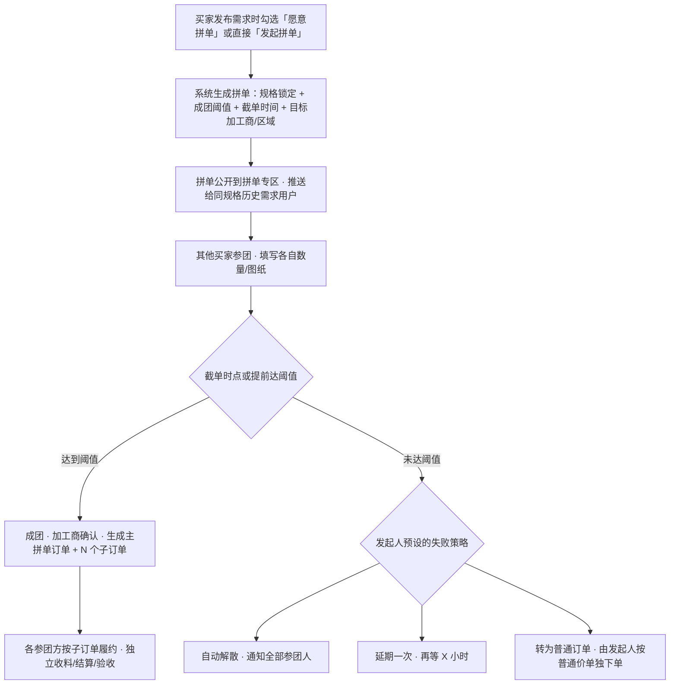
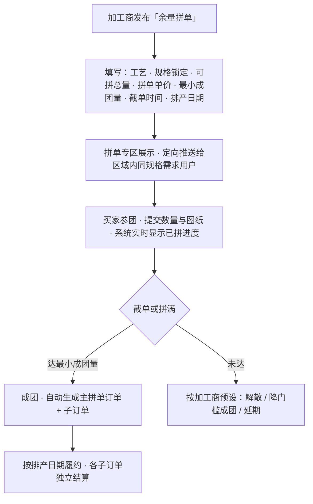
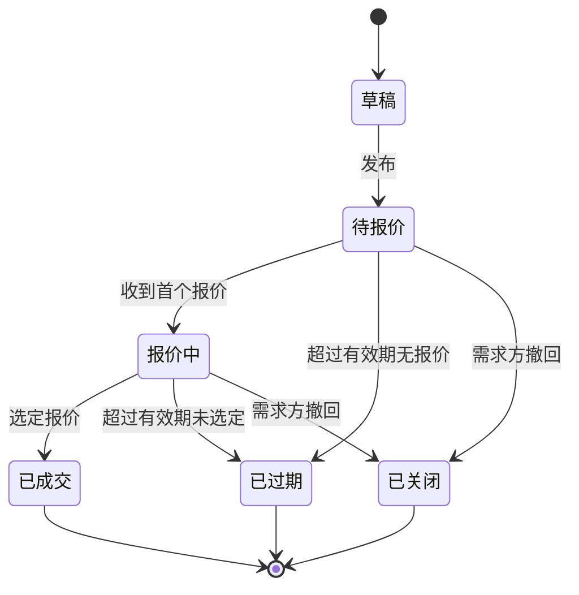
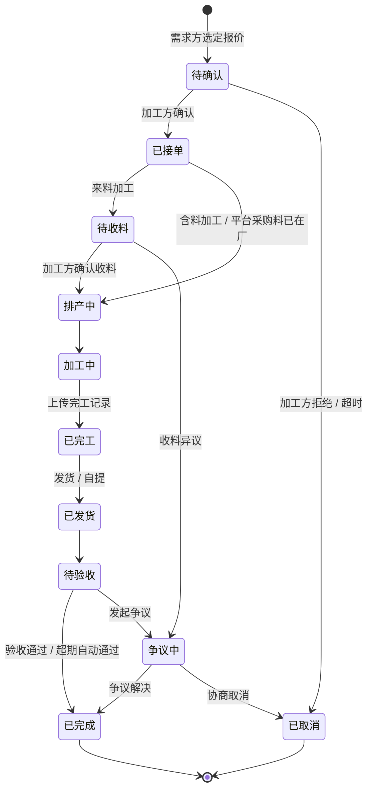
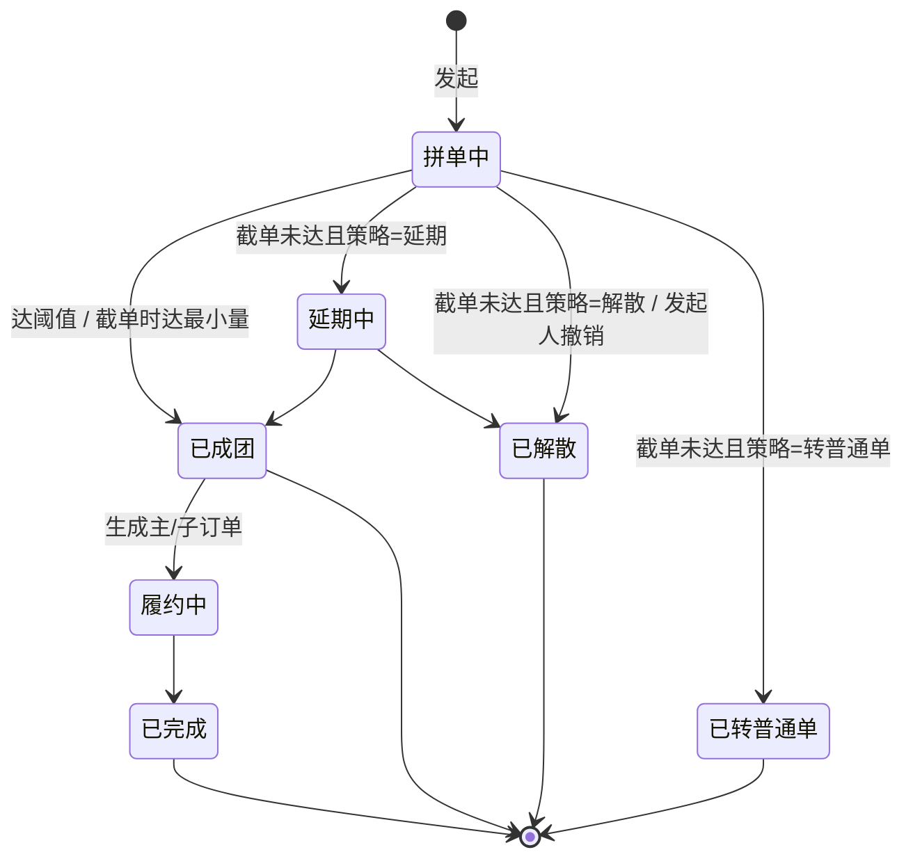
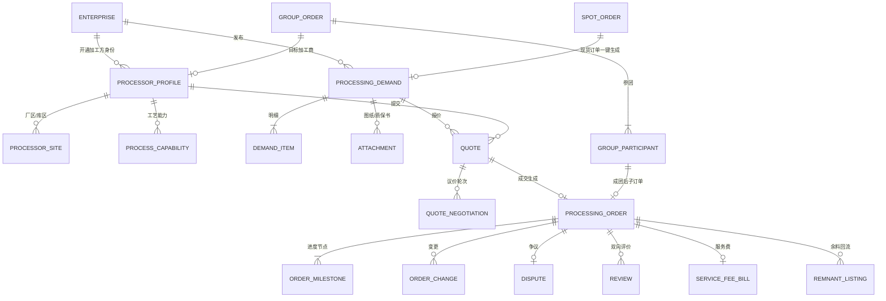

# 货袋子 · 加工服务板块 产品设计方案（v0.1 待确认稿）

| 项目 | 说明 |
| --- | --- |
| 文档状态 | v0.1 · 待业务方确认（确认后再进入原型与技术方案阶段） |
| 适用平台 | 货袋子现货资源平台（已完成冷启动，注册用户 2 万+） |
| 板块定位 | 现货资源之外的第二增长曲线：**加工服务撮合**（含拼单加工），平台收取撮合技术服务费 |
| 本稿不含 | 高保真 HTML 原型、接口定义、详细库表 DDL（待方案确认后输出） |
| 配套文档 | [AI 接入方案与市场价值评估 v0.1](./processing-service-ai-and-market-analysis-v0.1.md) |

---

## 0. 一页纸摘要

- **做什么**：在现货资源平台之上，新增"加工服务"板块，把"有料要加工的人"（买家/贸易商/终端厂）和"有设备有产能的人"（加工厂/带加工线的钢贸商/仓储加工中心）撮合起来，覆盖开平、纵剪、剪切、火焰/等离子/激光切割、折弯、锯切、镀锌等主流工艺；同时提供**拼单加工**能力（买家发起、商家发起），解决"量小不够起订、单独加工成本高、设备换规格浪费"的行业痛点。
- **怎么赚钱**：以**成交撮合技术服务费**为主（建议对加工方按加工费成交额 3%～5% 收取、设单笔上下限），叠加**拼单撮合费**、**加工商认证会员**与**担保交易/物流/质检等增值服务**，后续延伸至供应链金融。
- **为什么现在做**：① 2 万用户里已经沉淀了真实的"料 → 加工 → 用"需求；② 加工是现货成交的天然下游，"买料 + 加工 + 送货"一站式能显著提升现货侧转化和复购；③ 加工环节非标、信息不对称、区域化，是典型的高频撮合场景，平台有明确价值。
- **怎么起步**：一期 MVP 聚焦 **5 类标准工艺 + 询价报价 + 订单履约 + 基础拼单（规则成团 + 运营辅助）+ 服务费闭环**；二期做智能匹配、自动成团、担保交易、余料回流；三期做产能地图、排产协同、供应链金融与开放 API。
- **需要您确认的关键决策**：见 [第 15 章 待确认事项](#15-待确认事项需要您决策)。

---

## 1. 背景、目标与成功指标

### 1.1 背景

1. 现货平台冷启动完成，用户结构以贸易商、终端加工厂、采购员为主，日常询盘中"能不能顺带开平/切割/定尺"的诉求频繁出现，但目前只能线下私聊解决，平台无法沉淀、无法收费、也无法保障履约。
2. 加工服务商极度分散：大型钢贸商自带开平/纵剪线、第三方加工中心、小型激光/火焰切割作坊、镀锌厂等，各家产能、设备、工艺范围、价格差异巨大，需求方找加工商主要靠熟人和口碑，效率低。
3. 加工环节天然存在"拼"的需求：开平/纵剪有起订吨位和换规格调机成本；激光切割一张整板往往用不完；热镀锌按锌锅批次计价；这些都让小批量需求方吃亏，而加工商则希望把机台/批次填满。

### 1.2 业务目标

| 层级 | 目标 |
| --- | --- |
| 业务 | 把加工需求从"线下私聊"搬到"线上下单"，形成可收费、可追溯、可评价的撮合闭环 |
| 商业 | 建立以撮合技术服务费为核心的收入模型，验证费率与付费意愿 |
| 生态 | 让加工商成为平台第二类供给方，反哺现货成交（买料 + 加工一站式），并把加工余料回流到现货余料市场 |

### 1.3 北极星指标与关键指标（建议）

- **北极星指标**：月度在线完成的加工订单 GMV（加工费口径）。
- 供给侧：已认证加工商数、覆盖工艺数、覆盖城市/仓库数、平均报价响应时长。
- 需求侧：加工需求发布量、需求获得 ≥3 个有效报价的比例、需求 → 成交转化率、拼单成团率。
- 商业化：服务费收入、有效付费加工商数、单订单平均服务费、飞单率（估算）。
- 体验：订单准时交付率、争议率、需求方复购率、NPS。

---

## 2. 行业洞察（从 20 年加工商视角）

> 这部分是产品设计的"业务底座"，直接决定后面需求单模板、计价方式、拼单规则和争议处理怎么设计。

### 2.1 主流加工工艺与计价方式

| 分类 | 工艺 | 典型对象 | 常见计价口径 | 关键参数 | 起订/最低消费 | 备注 |
| --- | --- | --- | --- | --- | --- | --- |
| 板卷类 | 开平（卷 → 平板） | 热轧/冷轧/镀锌卷 | 元/吨 | 材质、厚度、宽度、定尺长度、平整度要求 | 通常 3～5 吨起 / 最低消费 | 有头尾料损耗，换规格需调机 |
| 板卷类 | 纵剪/分条 | 卷板 | 元/吨（按分条宽度分档） | 分条宽度、条数、厚度、卷径、内径 | 5 吨起较常见 | 窄条加价，边丝归属需约定 |
| 板卷类 | 横切定尺 | 卷板/平板 | 元/吨 或 元/张 | 长度、张数、公差 | 有起步费 | |
| 板材类 | 剪板（闸式剪） | 中薄板 | 元/刀 或 元/米 | 厚度、剪切长度、刀数 | 起步费 | 最常见的小批量需求 |
| 板材类 | 火焰切割 | 中厚板（≥8mm） | 元/米（分厚度档）+ 穿孔费 | 厚度、切割总长、穿孔数、图形复杂度 | 起步费 | 热变形、割渣需说明 |
| 板材类 | 等离子切割 | 中薄板、不锈钢 | 元/米（分厚度档） | 同上 | 起步费 | 精度优于火焰 |
| 板材类 | 激光切割 | 薄板（≤20mm 碳钢、≤12mm 不锈钢） | 元/米 + 穿孔费，或按工时/按件 | 厚度、材质、切割长度、穿孔数、套料利用率 | 起步费 | 整板利用率是核心成本变量，天然适合拼单 |
| 板材类 | 折弯 | 薄中板 | 元/刀（分长度/厚度档） | 折弯长度、刀数、角度、模具 | 起步费 | 特殊模具另计 |
| 板材类 | 冲孔/钻孔、坡口、卷圆、校平、打磨 | 板材 | 按件/按米/按工时 | 图纸 | 起步费 | 常作为切割后配套工序 |
| 型材/管材 | 锯切定尺、打孔、弯弧 | H 型钢、角钢、槽钢、方管圆管 | 元/刀、元/根、元/吨 | 规格、定尺长度、根数 | 起步费 | |
| 表面处理 | 热镀锌 | 型材、管材、结构件 | 元/吨（含锌） | 锌层厚度、挂具要求 | 按锌锅批次 | 天然按批次拼 |
| 表面处理 | 抛丸除锈、喷漆/喷塑 | 板材、结构件 | 元/㎡ 或 元/吨 | 除锈等级、涂层厚度 | 起步费 | |
| 综合 | 简单焊接结构件、来图小批量加工 | 结构件 | 包干价/按工时 | 图纸、BOM | 议价 | 一期不做重点，可放"其他/来图议价" |

**设计启示**

- 需求单不能是一个万能表单，必须**按工艺分模板**，每个模板有自己的必填参数和计价口径；否则加工商无法报价、报价不可比。
- 报价必须结构化：**单价 + 计价单位 + 起步费/最低消费 + 损耗率/余料约定 + 交期 + 物流方式**，而不是一句"大概 60 一吨"。
- "起订量"和"调机成本"是拼单存在的根本原因，拼单规则要围绕这两点设计。

### 2.2 材料来源的三种形态

| 形态 | 说明 | 平台价值 | 复杂度 |
| --- | --- | --- | --- |
| **来料加工** | 需求方自己有料（自有库存或从别处买），送到加工商加工 | 纯撮合，最简单 | 低 |
| **平台采购 + 加工** | 需求方在货袋子现货侧买料，直接指定送到加工商加工后再送到目的地 | **一站式，是与现货平台最强的联动点**，也是最值钱的场景 | 中 |
| **含料加工（加工商代购）** | 加工商自备料/代购料，按"材料价 + 加工费"报价 | 加工商侧常见（尤其带加工线的钢贸商） | 中（涉及材料价格与质保书） |

**设计启示**：需求单必须有"材料来源"字段，三种形态在报价结构、结算基数、质保书传递、损耗责任上都不同。

### 2.3 需求方的真实痛点

1. **找不到合适的加工商**：不知道谁能做、谁离仓库近、谁有空档、谁做得好。
2. **价格不透明**：同城开平价格能差 30%，小客户被"起订量"卡住。
3. **交期没保障**：加工商接单后被大客户插队，没人告知进度。
4. **质量争议难处理**：尺寸超差、切口挂渣、板面划伤、数量短少，口头约定无法举证。
5. **物流来回折腾**：料在 A 仓，加工在 B 厂，用在 C 地，三段物流、两次装卸费。
6. **余料不知道怎么处理**：切割余料、开平头尾料、分条边丝，要么被加工商"顺走"，要么堆在角落。

### 2.4 加工商的真实痛点

1. **产能不饱和 / 波动大**：设备闲着就是亏钱，旺季又忙不过来。
2. **小单不划算**：调机半小时、干活十分钟，不接又怕丢客户。
3. **收款风险**：小客户加工费拖欠，没有担保机制不敢接生单。
4. **需求描述不清**：客户一句"给我切几块"，来回沟通十遍还出错，出了问题互相甩锅。
5. **图纸和规格反复变更**，没有版本留痕。
6. **获客成本高**：靠老关系和熟人介绍，缺少低成本获取新客的渠道。

### 2.5 为什么"拼单"在加工场景成立

| 场景 | 拼的对象 | 谁受益 |
| --- | --- | --- |
| 开平/纵剪 | 同材质、同厚度（纵剪还要同卷宽）的多个小需求，凑满起订吨位，共享一次调机 | 需求方拿到大单价，加工商填满机台 |
| 激光/等离子切割 | 同材质、同厚度的零件在同一张整板上套料，提高整板利用率 | 需求方分摊整板成本，加工商减少余料 |
| 热镀锌 | 同一锌锅批次凑满 | 双方 |
| 火焰切割厚板 | 同一张厚板的多个订单套料 | 双方 |
| 物流拼车 | 同一加工商、同一方向的多个订单拼一辆车 | 需求方 |

**两种发起方向**

- **买家发起**："我有 2 吨 Q235B 2.0×1250 的卷要开平，不够 5 吨起订，谁一起？"——平台把它公开为拼单，同规格的人加入，满阈值成团。
- **商家发起**（加工商或带加工线的卖家）："周三 3.0mm 热卷开平线有 15 吨余量，拼单价 45 元/吨，周二 18 点截单"或"这张 10mm 整板还剩 40% 面积可以拼切"——这是加工商主动卖"产能余量"和"整板余量"。

**拼单的四个必须解决的问题**（后面第 6 章逐一给出规则）：成团条件与截止、未成团怎么办、费用怎么分摊、余料归谁 + 混料如何防范。

---

## 3. 角色与用户画像

| 角色 | 典型用户 | 核心诉求 | 在平台中的主要动作 |
| --- | --- | --- | --- |
| **需求方（买家）** | 终端加工厂采购、贸易商（替下游客户代办加工）、工程项目部、小型机加工作坊 | 快速找到合适加工商、价格透明、交期可控、质量有保障、可以拼单省钱 | 发布需求、比价、下单、参团/发起拼单、验收、评价、争议 |
| **加工服务商（加工方）** | 第三方加工中心、带开平/纵剪线的钢贸商、激光/火焰切割厂、镀锌厂、仓储加工一体的库区 | 稳定获客、填满产能、清晰的需求描述、收款有保障、出问题有据可依 | 入驻、维护能力档案、报价/抢单、接单、更新进度、发起拼单（余量档期）、结算 |
| **卖家（现货侧既有角色）** | 平台上的现货供应商 | 把"料 + 加工"打包卖，提高成交率 | 在现货详情页挂"支持加工/推荐加工商"，可发起含料拼单 |
| **平台运营** | 货袋子运营、客服、风控 | 审核供给质量、促成成交、处理争议、监控飞单、配置费率 | 审核、工艺字典维护、拼单辅助成团、仲裁、报表 |
| **物流方（可选）** | 平台合作车队/物流商 | 承接"仓 → 厂 → 客"的多段运输 | 一期作为信息展示与推荐，不做深度集成 |

**权限说明**：一个账号可以同时是买家与加工方（如带加工线的钢贸商），加工方身份需单独认证开通。

---

## 4. 业务模式与商业化设计

### 4.1 平台定位：撮合 + 履约保障，不做自营加工

- 平台不持有设备、不承担加工质量的第一责任，但通过**结构化需求、结构化报价、留痕、评价、担保**来降低交易摩擦，并以此收费。
- 平台是"规则制定者 + 见证方 + 结算通道（可选）"。

### 4.2 收费模型（建议方案 + 备选）

#### 现实约束：加工费的绝对值不高

举例：100 吨热卷开平，加工费约 50 元/吨 → 加工费 5,000 元，3% 服务费仅 150 元；而 30 米 10mm 激光切割加工费可能只有几百元。**单靠"加工费 × 费率"的 ARPU 偏低**，所以收费结构必须组合设计，并与现货侧联动放大价值。

#### 建议方案（组合式）

| 收入项 | 对象 | 规则建议 | 说明 |
| --- | --- | --- | --- |
| **A. 成交撮合技术服务费（主）** | 加工方 | 按订单**加工费**成交额的 **3%～5%**（建议初期 3%），**单笔下限 20 元、上限 800～1,000 元**；需求方免费 | 需求方免费拉动需求侧；设上限降低大单飞单动机；费率按工艺可配置 |
| **B. 拼单撮合费** | 拼单参团方（需求方） | 子订单加工费的 **1%～2%**，加工方免收 | 拼单让需求方拿到了更低单价，付费意愿最强；加工方免收以鼓励其发起"余量拼单" |
| **C. 加工商认证会员（年费）** | 加工方 | 基础入驻免费；认证会员享：需求直推、搜索加权、"认证加工商"标识、发起拼单权限、服务费费率优惠（如 3% → 2%） | 与现货侧会员体系打通，一期即可上线 |
| **D. 担保交易服务** | 双方 | 加工费由平台托管，验收后放款；收取 0.5%～1% 或包含在 A 中 | 解决加工方收款焦虑，是反飞单最有力的抓手；二期上线（涉及支付牌照/合规，可走第三方担保支付） |
| **E. 增值服务** | 双方 | 物流推荐佣金、第三方质检、加工保险、发票代开、余料回收挂牌 | 逐步叠加 |
| **F. 广告与推广位** | 加工方 | 首页/工艺分类页推荐位、拼单专区置顶 | 二期 |

#### 备选模型（供对比）

| 模型 | 优点 | 缺点 |
| --- | --- | --- |
| 仅会员年费、成交免费 | 简单、无飞单问题 | 供给方前期不愿付费，无法与成交价值挂钩 |
| 线索费（加工方为每次报价/查看联系方式付费） | 收入前置、现金流好 | 加工商反感、会抑制报价数量，损害需求方体验 |
| 按成交额纯比例、无上下限 | 逻辑最简单 | 大单飞单动机强、小单收不到钱 |

**建议**：一期上线 **A + B + C**，二期上线 **D**，E/F 按需。

### 4.3 服务费收取时点与方式

| 阶段 | 建议 |
| --- | --- |
| 一期（无资金托管） | 订单在线"确认成交"后生成服务费账单；加工方在**订单完结后 T+7 内**支付；未支付则限制接新单与报价；月度可合并出账 |
| 二期（担保交易） | 需求方支付加工费到托管账户 → 验收后平台扣除服务费、余款放款给加工方，服务费自动结清 |

### 4.4 反飞单（线下绕单）策略

飞单是所有撮合平台的核心风险，必须从产品机制上设计，而不是靠人盯：

1. **联系方式隔离**：报价阶段双方不可见手机号；需求方"选定报价 → 订单确认"后才互换联系方式，且同步生成订单与服务费凭证。
2. **在线沟通与图纸留痕**：订单内 IM/留言、图纸版本管理，让"在线"比"线下"更省事。
3. **信用与曝光挂钩**：加工方的在线成交量决定搜索排序、需求直推优先级、拼单发起权限；飞单意味着丢曝光。
4. **履约保证金（可选）**：认证加工方缴纳一定保证金，用于争议赔付与违约扣罚。
5. **举报奖励**：需求方举报加工方要求线下交易，核实后免除本单拼单费/给予现货优惠券。
6. **费率不惩罚大单**：设置服务费上限，让大单也愿意留在线上。
7. **服务价值绑定**：担保交易、进度追踪、争议仲裁、评价沉淀只有在线单才有。

---

## 5. 核心业务流程

### 5.1 标准加工订单主流程

**关键节点说明**

- **发布需求**：按工艺模板填写，支持上传图纸（DXF/DWG/PDF/图片）、质保书；选择材料来源；填写期望交期、交付地点、物流方式。
- **匹配**：一期以规则过滤（工艺 + 材质 + 规格范围 + 地域）+ 简单评分排序为主，推送给 Top N 加工商；同时需求可选择"公开到需求大厅"。
- **报价**：结构化报价单，有效期；需求方可对单个报价发起"议价"（一次或多轮）。
- **确认订单**：需求方选定即生成订单，订单快照锁定需求参数、图纸版本与报价明细。
- **收料确认**：来料加工场景的责任分界点，加工方需确认数量、规格、外观，有异议在此提出。
- **进度更新**：加工方按节点更新（已接单 → 已收料 → 排产中 → 加工中 → 已完工 → 已发货），并可上传照片。
- **验收**：需求方在收货后 N 天内（建议 3 天）验收，超期自动视为验收通过。
- **评价**：双向评价（需求方评加工方：质量、交期、服务；加工方评需求方：需求清晰度、配合度、付款）。

### 5.2 拼单加工流程（买家发起）

### 5.3 拼单加工流程（商家发起 · 余量档期）

### 5.4 争议处理流程

1. 需求方在验收期内发起争议，选择类型（尺寸超差 / 数量短少 / 表面质量 / 交期延误 / 材料混料 / 其他），上传证据（照片、量具照片、磅单）。
2. 加工方 48 小时内响应：接受（返工 / 补做 / 折价 / 退款）或拒绝并举证。
3. 双方协商 3 天未达成一致，平台介入仲裁，依据订单快照（参数、图纸版本、公差约定）、收料记录、完工记录、聊天记录给出处理意见。
4. 争议结果影响双方信用分；恶意争议同样扣分。

### 5.5 状态机

**需求单状态**

**加工订单状态**

**拼单状态**

---

## 6. 功能模块设计

### 6.1 加工商入驻与能力档案

| 子功能 | 说明 |
| --- | --- |
| 入驻申请 | 企业资质（营业执照、法人/经办人、开票信息）、加工场地地址（支持多个厂区/库区）、联系人；复用现货侧企业认证结果 |
| 能力档案（核心） | 按工艺逐条维护：工艺类型、可加工材质、厚度范围、宽度/长度极限、精度/公差等级、设备清单（型号、数量、幅面）、日产能、起订量/最低消费、参考价格区间、可否含料、可否库内加工 |
| 服务范围 | 服务半径 / 可覆盖城市、是否提供送货、是否支持自提、装车费规则 |
| 展示信息 | 厂区照片、设备照片、案例、资质证书（ISO、特种设备等）、营业时间 |
| 状态与信用 | 认证状态、信用分、成交量、准时率、争议率、响应时长（系统自动计算） |
| 档期/产能日历（二期） | 加工商可标记未来 N 天各设备的"忙/闲/余量"，供匹配与"余量拼单"使用 |

**运营侧**：入驻审核（资料真实性、设备实拍）、工艺字典与参数字典维护（材质、厚度档、计价单位等全部字典化，保证需求与报价可比）。

### 6.2 加工需求发布（按工艺模板）

一期建议上线 **5 类标准模板 + 1 个"来图议价"通用模板**：

1. 开平 / 横切定尺
2. 纵剪 / 分条
3. 剪板 / 折弯
4. 火焰 / 等离子 / 激光切割（来图）
5. 型材/管材锯切定尺
6. 其他（来图议价，非结构化）

**通用字段**：材料来源（来料 / 平台采购 / 加工商含料）、材质、规格、数量（吨/张/件/米）、期望交期、交付地点、物流方式（加工商送货 / 自提 / 平台推荐物流）、是否愿意拼单、报价有效期、是否公开到需求大厅、备注。

**模板专属字段（示例：开平）**：卷板厚度、宽度、材质、定尺长度、张数或吨位、平整度要求、是否需要垫纸/打包方式、头尾料归属。

**模板专属字段（示例：切割）**：图纸文件（DXF/DWG/PDF）、板厚、材质、零件数量、切口质量要求、公差等级、是否需要去毛刺/坡口、余料归属；二期可对 DXF 自动解析切割长度与穿孔数辅助报价。

**辅助能力**

- 从现货订单一键生成加工需求（自动带入材质规格数量，并把现货所在仓库设为取料地）。
- 常用需求模板保存与复制发布。
- 需求审核：一期对首次发布用户人工审核，老用户免审。

### 6.3 匹配与推荐

- **硬过滤**：工艺 ∈ 加工商能力 → 材质/厚度/宽度在范围内 → 数量 ≥ 起订量（或需求已勾选愿意拼单）→ 交付地点在服务范围内 → 加工商状态正常。
- **评分排序（一期简单加权）**：距离（30%）、信用分与评价（25%）、历史同工艺报价水平（20%）、报价响应速度（15%）、近 90 天成交量（10%）。权重后台可配。
- **推送**：Top N（默认 5～8 家）站内消息 + 短信/微信通知；需求方可选择"公开到需求大厅"让更多加工商自主报价。
- **二期**：加入产能日历、余量拼单匹配、需求方历史偏好（"上次合作过的加工商优先"）。

### 6.4 报价与议价

- **结构化报价单**：单价 + 计价单位、起步费/最低消费、预计总价（系统按需求数量自动计算）、损耗率与余料处理方式、交期（工作日）、物流方式与费用、报价有效期、备注（如"含吊装""不含打包"）。
- **含料加工报价**额外拆分"材料单价 + 加工单价"，材料需标注厂家/质保书可否提供。
- **报价对比页**：需求方以表格对比多家报价（总价、交期、距离、信用分、含/不含物流），可一键"议价"（给出目标价 + 理由），加工方可修改报价或拒绝，保留议价轮次记录。
- **报价限制**：单个需求每家加工商仅一个有效报价（可更新）；报价过期自动失效。

### 6.5 拼单中心（一期基础版 · 二期自动化）

#### 6.5.1 拼单对象与规格锁定

拼单的前提是"能放在同一次调机/同一张板/同一锅里"，所以每个拼单必须锁定**拼单键**：

| 工艺 | 拼单键（必须一致） | 允许差异 |
| --- | --- | --- |
| 开平 | 材质 + 厚度 + 卷宽 + 加工商（或区域）| 定尺长度、数量 |
| 纵剪 | 材质 + 厚度 + 卷宽 + 加工商 | 分条宽度组合（需加工商确认能排刀） |
| 激光/等离子/火焰切割 | 材质 + 厚度 + 加工商 | 零件图形、数量 |
| 热镀锌 | 加工商 + 批次日期 | 构件类型、重量 |
| 型材锯切 | 材质 + 型号规格 + 加工商 | 定尺长度、根数 |

#### 6.5.2 成团规则

- **成团阈值**：以吨位、张数、面积占比或金额为单位，由发起人（或加工商）设置；商家发起可设"最小成团量"与"最大可拼量"。
- **截单时间**：必填；一期允许 1～7 天。
- **提前成团**：达阈值即可由加工商点击"提前成团"（防止继续等导致排产延误）。
- **阶梯价格（可选）**：拼到 5 吨 50 元/吨、10 吨 45 元/吨，成团时按最终总量统一取价，所有参团方享同一单价。
- **未成团策略**（发起时预设）：解散 / 延期一次 / 转普通单（发起人按普通价单独下单）；商家发起可选"降门槛成团"。
- **参团资格**：一期对参团人不设门槛，但含"愿意拼单"需求的用户会收到定向推送；二期可要求参团人预付定金或加工费到托管账户。

#### 6.5.3 费用分摊规则

- **按量分摊**：加工单价 × 各自数量（吨/张/米）。
- **公共费用均摊**：起步费/调机费/整板底价等"一次性费用"按各自数量占比分摊（不是按人头），避免大单补贴小单的争议。
- **物流**：默认各自结算；若选择拼车，运费按重量占比分摊。
- **拼单撮合费**：向各参团方按子订单加工费收取（见 4.2 B）。
- 所有分摊规则在拼单详情页**成团前透明展示**，参团即视为同意。

#### 6.5.4 余料与混料

- **余料归属**：发起时必须选择——① 各自余料归各自（切割类可按图纸区分）；② 余料归加工商折价（体现在更低的加工单价上）；③ 余料归平台"余料市场"挂牌出售，收益按占比返还参团方（二期，与现货余料板块联动）。
- **混料防范**：成团后系统为每个子订单生成**唯一标识码**，加工商完工时必须按子订单分捆/分托打标签并拍照上传；来料加工场景下每个参团方的料入厂时单独收料确认，并记录炉批号/质保书。
- **责任边界**：子订单相互独立，一方料未到不影响其他方（加工商可选择"等齐再干"或"到多少干多少"，需在拼单发布时声明）。

#### 6.5.5 一期与二期分工

- **一期**：拼单发起/参团/进度展示/规则展示/成团生成子订单/费用分摊计算；成团判定由系统按阈值执行，运营人员可在后台"辅助成团"（如差一点点时人工撮合加工商降门槛）。
- **二期**：自动向同规格历史需求用户推送、按产能日历自动建议"余量拼单"、切割类 DXF 自动套料估算利用率、参团托管预付。

### 6.6 订单管理与履约

- **需求方视角**：订单列表（按状态筛选）、订单详情（进度时间轴、参数与图纸快照、报价明细、收料/完工照片、物流信息、聊天记录）、验收操作、发起争议、评价。
- **加工方工作台**：待确认 / 待收料 / 排产中 / 加工中 / 已完工 / 已发货 各队列；批量更新进度；上传完工照片与尺寸检测记录（一期为拍照 + 手填，二期支持检测表模板）；打印子订单标签。
- **变更管理**：订单确认后，需求参数/图纸变更需走"变更申请 → 加工方确认 → 价格/交期重新确认"，保留变更记录。
- **取消规则**：加工方接单前需求方可免责取消；排产后取消需加工方同意，可能产生调机费；争议中不可单方取消。
- **超时机制**：加工方 24 小时未确认订单自动取消并影响响应指标；需求方收货 3 天未验收自动通过。

### 6.7 结算、服务费与发票

- **加工费结算（一期）**：线下结算 + 平台记录（加工方标记"已收款"、需求方确认）；订单完成后 T+7 生成服务费账单。
- **加工费结算（二期）**：担保交易，加工费托管，验收后放款并自动扣除服务费。
- **服务费账单**：按订单生成，按月汇总；支持在线支付；逾期未付限制接单与报价；账单可开具技术服务费发票。
- **加工费发票**：由加工方直接向需求方开具，平台仅记录开票状态；二期可接入税务/电子发票服务。

### 6.8 评价与信用体系

- **双向评价**：订单完成后 7 天内互评，维度见 5.1；匿名展示。
- **加工方信用分**（0～1000，后台可配权重）：实名认证与资质、成交量、准时交付率、争议率与败诉率、响应时长、评价均分、服务费缴纳及时性、拼单履约情况。
- **需求方信用分**：需求真实性（发布后成交率）、付款及时性、恶意争议记录。
- **等级与权益**：信用分决定搜索排序、需求直推优先级、拼单发起权限、保证金额度。

### 6.9 消息通知

- 触点：新需求推送、收到报价、议价回复、订单确认、收料确认、进度更新、拼单进度/成团/解散、验收提醒、争议、服务费账单、评价提醒。
- 渠道：站内消息、微信服务号/小程序模板消息、短信（关键节点）、App 推送（若有）。
- 用户可配置通知偏好；加工方可设置"只接收我能做的工艺 + 我服务范围内"的需求推送。

### 6.10 运营后台

- 加工商审核与管理（认证、能力档案审核、处罚/冻结）。
- 工艺字典、参数字典、需求模板、计价单位维护。
- 需求审核与需求大厅管理（置顶、下架）。
- 拼单监控（进度、即将截单未成团列表、辅助成团操作）。
- 争议仲裁工作台。
- 服务费规则配置（按工艺费率、上下限、拼单费率、会员优惠）、账单管理、逾期催收。
- 数据看板：见 1.3 指标。

---

## 7. 与现货资源平台的联动设计

| 联动点 | 说明 | 价值 |
| --- | --- | --- |
| 现货详情页"支持加工" | 展示该资源所在仓库附近可提供开平/纵剪/切割的加工商，或卖家自带加工能力；一键"买料 + 加工" | 提升现货成交率与客单价 |
| 现货订单 → 加工需求 | 从现货订单一键生成加工需求，材料来源=平台采购，取料地=现货仓库 | 降低发布成本，形成一站式 |
| 卖家发起含料拼单 | 带加工线的钢贸商可对自己的现货卷板发起"含料开平拼单" | 帮卖家去库存，是商家发起拼单的重要形态 |
| 余料回流 | 加工产生的余料（头尾料、边丝、切割余料）一键挂牌到现货余料市场 | 解决余料痛点，增加现货侧供给 |
| 统一账户与信用 | 企业认证、会员、信用分、消息中心复用 | 降低用户学习成本 |
| 库内加工 | 仓库同时具备加工能力时标记"库内加工"，省一段物流 | 显著降低需求方总成本 |

---

## 8. 信息架构与页面清单（低保真描述）

### 8.1 需求方端（小程序 / App / H5）

| 页面 | 关键内容 |
| --- | --- |
| 加工服务首页 | 工艺分类入口（开平、纵剪、切割、折弯、锯切、镀锌、其他）、"发布需求"主按钮、拼单专区入口（正在拼/即将截单）、推荐加工商、附近加工商（基于定位/常用仓库） |
| 发布需求（分步表单） | 第一步选工艺 → 第二步填参数与图纸 → 第三步材料来源/交期/交付/物流/是否拼单 → 预览发布 |
| 我的需求 | 列表（待报价/报价中/已成交/已过期/已关闭）、需求详情、报价对比、议价 |
| 拼单专区 | 拼单列表（筛选工艺/材质/厚度/区域/截单时间）、拼单详情（规格锁定、进度条、单价/阶梯、分摊规则、余料规则、参团人数、加工商信息）、参团表单、发起拼单 |
| 加工商主页 | 能力档案、设备与案例、信用与评价、正在发起的拼单、"向他询价" |
| 订单 | 列表、详情（进度时间轴、快照、照片、物流）、验收、争议、评价 |
| 消息中心 | 复用现货侧 |

### 8.2 加工方端（小程序 / PC 工作台）

| 页面 | 关键内容 |
| --- | --- |
| 入驻 / 能力档案 | 资质、厂区、按工艺维护能力条目、服务范围 |
| 需求大厅 | 匹配推送的需求 + 公开需求；筛选；需求详情；报价表单 |
| 我的报价 | 待回复议价、有效报价、已失效、已成交 |
| 订单工作台 | 状态队列、批量进度更新、收料确认、完工上传、发货、子订单标签打印 |
| 发起拼单（余量档期） | 表单：工艺、规格锁定、可拼量、拼单价/阶梯、最小成团、截单、排产日期、未成团策略、余料规则 |
| 结算中心 | 加工费收款记录、服务费账单、在线支付、发票 |
| 数据看板 | 曝光、报价数、成交率、准时率、评分、信用分 |

### 8.3 运营后台（PC）

加工商管理、字典与模板、需求管理、拼单监控、争议仲裁、费率与账单、报表（见 6.10）。

---

## 9. 核心数据模型（概念级）

**核心实体与关键字段（摘要）**

| 实体 | 关键字段 |
| --- | --- |
| PROCESSOR_PROFILE 加工方档案 | enterprise_id、认证状态、信用分、会员等级、保证金、服务半径、可含料、可库内加工 |
| PROCESSOR_SITE 厂区 | 地址、经纬度、联系人、是否与现货仓库关联 |
| PROCESS_CAPABILITY 工艺能力 | 工艺类型、材质集合、厚度区间、宽度/长度极限、精度等级、设备清单、日产能、起订量、最低消费、参考价格区间、计价单位 |
| PROCESSING_DEMAND 需求单 | 工艺类型、模板版本、材料来源、交付地址、期望交期、物流方式、是否愿拼单、是否公开、报价有效期、状态、来源现货订单 id |
| DEMAND_ITEM 需求明细 | 材质、厚度、宽度、长度、数量、数量单位、模板专属参数（JSON） |
| QUOTE 报价 | 单价、计价单位、起步费、预计总价、损耗率、余料方式、交期天数、物流方式与费用、材料单价（含料）、有效期、状态 |
| PROCESSING_ORDER 加工订单 | 需求快照、报价快照、图纸版本、加工费总额、服务费金额与费率、状态、收料记录、完工记录、发货信息、验收时间、所属拼单 id |
| GROUP_ORDER 拼单 | 发起方类型（买家/商家）、拼单键（工艺+材质+厚度+宽度+加工商）、阈值类型与数值、最大量、阶梯价、截单时间、未成团策略、余料规则、分摊规则、状态 |
| GROUP_PARTICIPANT 参团 | 参团方、数量、图纸、分摊金额、子订单 id、状态 |
| SERVICE_FEE_BILL 服务费账单 | 订单 id、费率、基数、金额、类型（成交/拼单）、应付方、状态、支付时间 |
| DISPUTE 争议 | 类型、证据、加工方响应、协商记录、仲裁结果、责任方 |
| REVIEW 评价 | 方向、各维度评分、文字、匿名 |

---

## 10. 关键规则与算法说明

### 10.1 匹配评分（一期）

`score = 0.30 × 距离分 + 0.25 × 信用分归一化 + 0.20 × 价格竞争力 + 0.15 × 响应速度 + 0.10 × 近 90 天成交量归一化`

- 距离分：按加工厂区到取料地/交付地的较小值分档（≤30km 满分，>200km 0 分）。
- 价格竞争力：同工艺同厚度档历史成交单价相对区域中位数的位置。
- 冷启动的新加工商：给予"新入驻加成"保证一定曝光，避免马太效应。

### 10.2 报价合理性提示

- 系统按同工艺同厚度档近 90 天区域成交价给出参考区间；报价显著高于/低于区间时，对需求方展示"高于参考价 X%"提示；对加工方提示"低于成本预警"（防止恶意低价再线下加价）。

### 10.3 服务费计算

`服务费 = clamp(加工费成交额 × 费率(工艺, 会员等级), 单笔下限, 单笔上限)`

- 拼单撮合费按子订单加工费 × 拼单费率，向参团方收取。
- 含料加工的服务费基数默认**仅取加工费部分**，材料部分若来自现货平台已在现货侧计费（待确认，见第 15 章）。

### 10.4 拼单成团与分摊

- 成团判定：`Σ 参团量 ≥ 阈值` 且当前时间 ≤ 截单时间，或截单时点 `Σ 参团量 ≥ 最小成团量`。
- 阶梯取价：按成团总量落入的阶梯统一取价。
- 公共费用分摊：`参团方 i 分摊 = 公共费用 × 量_i / Σ 量`。
- 拼车运费同理按重量占比。

### 10.5 信用分（示意）

初始 600 分；每完成一单 +5；准时交付 +2；争议败诉 −30；飞单被核实 −200 并冻结；服务费逾期 −10/次；评价 5 星 +3、1 星 −10。上限 1000、下限 0；权重后台可配。

---

## 11. 风控、合规与安全

- **资质真实性**：加工方需营业执照 + 设备实拍 + 厂区定位校验；抽查回访。
- **图纸保密**：图纸仅对被邀请报价的加工商可见，公开需求大厅默认只展示缩略图/参数；订单完成后加工方对图纸的访问权限在 N 天后收回；水印。
- **交易安全**：担保交易上线前，通过订单留痕 + 信用分 + 保证金弱约束；上线后走第三方支付托管，避免平台触碰资金合规红线。
- **合同与凭证**：订单确认即生成电子加工协议（含参数、图纸版本、公差、余料、交期、价格、违约条款），可下载。
- **反刷单**：同一企业双账号自成交、异常高频拼单等风控规则。
- **税务**：平台仅对技术服务费开票；加工费发票由加工方向需求方开具，平台不做代开（避免税务风险）。

---

## 12. 非功能性要求（概要）

- 复用现货平台账户、企业认证、消息、支付（若有）、文件存储；加工板块以独立业务域实现，便于后续独立演进。
- 图纸文件：支持 DXF/DWG/PDF/JPG/PNG，单文件 ≤ 50MB；私有存储 + 签名 URL。
- 关键操作（发布、报价、确认、收料、完工、验收、争议）全部留痕，可审计。
- 拼单截单/成团、订单超时、验收超时等由定时任务驱动，需保证幂等。
- 权限：加工方身份与买家身份分离授权；运营后台按角色分权（审核、仲裁、财务）。

---

## 13. 分期规划

> 按功能范围划分，不按日历时间。

### 一期 · MVP（跑通撮合与收费闭环）

- 加工商入驻 + 能力档案（按工艺）+ 审核
- 5 类标准工艺模板 + 来图议价模板；从现货订单一键生成需求
- 规则匹配 + 加权排序推送；需求大厅
- 结构化报价 + 议价 + 报价对比
- 订单全流程（含收料确认、进度、完工上传、验收、变更、取消）
- 拼单基础版：买家发起 / 商家发起、规格锁定、阈值、截单、未成团策略、分摊规则展示、成团生成子订单、运营辅助成团
- 争议流程（人工仲裁）
- 双向评价 + 信用分 v1
- 服务费：成交服务费（加工方付）+ 拼单撮合费 + 认证会员，线下结算加工费、线上支付服务费
- 运营后台基础功能与核心报表
- 反飞单基础机制：联系方式隔离、在线留痕、曝光与信用挂钩

### 二期 · 效率与保障

- 担保交易（加工费托管、自动扣费放款）
- 产能日历 + 余量拼单自动建议 + 同规格需求定向推送
- 切割类 DXF 自动解析（切割长度、穿孔数）与套料利用率估算辅助报价
- 余料一键回流现货余料市场；拼单余料收益分配
- 现货详情页"支持加工/买料 + 加工"深度融合，库内加工标签
- 物流推荐与拼车分摊
- 电子加工协议、检测记录模板
- 推广位与广告

### 三期 · 生态与金融

- 区域加工产能地图与价格指数（对外发布，形成行业影响力）
- 加工商轻量排产/工单 SaaS，与平台订单打通
- 供应链金融：加工费账期、基于订单的保理
- 第三方质检、加工保险
- 开放 API（大客户 ERP 直连下单）

---

## 14. 上线策略建议

1. **区域先行**：选 1～2 个现货用户最密集、且有 10～20 家可控加工商的城市试点，保证需求发出去有人报价。
2. **供给先行**：上线前完成首批 30～50 家加工商入驻与能力档案录入（运营代录 + 实地核验），覆盖开平/纵剪/切割三大类。
3. **定向激活**：从历史询盘/聊天中筛选出有加工诉求的现货用户，定向邀请首批发布需求；首批需求免拼单费。
4. **人工兜底**：试点期运营介入每一单的报价催促、拼单撮合和争议处理，快速沉淀规则。
5. **费率试验**：试点期以 3% 起步，对比两组城市不同费率/上限下的成交与飞单表现，再定全国策略。

---

## 15. 待确认事项（需要您决策）

| # | 事项 | 建议 | 备选 |
| --- | --- | --- | --- |
| 1 | 服务费付费方 | 加工方付成交服务费，需求方免费；拼单撮合费由参团方付 | 双向各付一半；全部由需求方付 |
| 2 | 服务费费率与上下限 | 3%，下限 20 元，上限 800～1,000 元；按工艺可配 | 5% 无上限；阶梯费率 |
| 3 | 含料加工的服务费基数 | 仅加工费部分 | 材料 + 加工全额（若材料未经过现货侧） |
| 4 | 一期是否上线担保交易（资金托管） | 二期上线，一期线下结算加工费 | 一期即接第三方担保支付 |
| 5 | 一期工艺范围 | 开平/横切、纵剪、剪板/折弯、切割（火焰/等离子/激光）、型材锯切 + 来图议价 | 增加热镀锌；或仅上 3 类 |
| 6 | 拼单一期范围 | 买家发起 + 商家发起同时上，规则成团 + 运营辅助 | 一期只做商家发起（更容易成团） |
| 7 | 拼单参团是否需要预付定金 | 一期不需要，二期随担保交易上线 | 一期即要求预付 |
| 8 | 加工商入驻是否收费 | 基础入驻免费，认证会员收年费 | 全部免费一年 |
| 9 | 试点城市与首批加工商来源 | 由您指定 1～2 个城市；运营代录首批 30～50 家 | 全国同时开放 |
| 10 | 需求方是否可以对加工商"隐藏身份"发布 | 一期实名（企业名可见），提升报价意愿 | 匿名发布，成交后可见 |
| 11 | 余料默认归属 | 默认"各自余料归各自"，可选折价归加工商 | 默认归加工商 |
| 12 | 与现货侧会员体系的关系 | 加工商会员作为现货会员的一个附加包 | 独立会员体系 |
| 13 | 端形态优先级 | 小程序（需求方 + 加工方）+ PC 运营后台优先；加工方 PC 工作台二期 | 全部端同时上 |

---

## 16. 术语表

| 术语 | 说明 |
| --- | --- |
| 开平 | 将卷板通过开卷、校平、剪切成定尺平板 |
| 纵剪/分条 | 将卷板沿长度方向剪成若干窄卷 |
| 横切定尺 | 将板/卷按指定长度切断 |
| 起订量 / 最低消费 | 加工商接单的最小数量或最低收费 |
| 调机费 | 更换规格需重新调整设备的一次性成本 |
| 套料 | 将多个零件在一张整板上排布以提高利用率 |
| 穿孔 | 切割每个封闭轮廓前的起始打孔动作，激光/等离子按次计费 |
| 头尾料 / 边丝 | 开平和纵剪产生的不可用余料 |
| 来料加工 / 含料加工 | 需求方自带材料 vs 加工商提供材料 |
| 库内加工 | 仓库内配备加工设备，料不出库即可加工 |
| 拼单键 | 判断多个需求能否放入同一次加工的一组必须一致的参数 |
| 撮合技术服务费 | 平台因促成交易向一方或双方收取的技术服务费 |
| 飞单 | 双方通过平台认识后转线下交易以规避服务费 |

---

## 17. 下一步（待您确认后）

1. 根据第 15 章的决策结论修订为 v1.0。
2. 输出低保真线框 → 高保真 HTML 原型（需求方小程序、加工方工作台、运营后台）。
3. 输出技术方案：领域模型与库表设计、接口清单、定时任务与状态机实现、与现货侧的集成点。
4. 输出试点运营 SOP：加工商招募话术与录入表、首批需求激活方案、争议处理规范。
