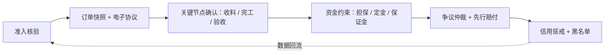

# 货袋子 · 加工撮合的权益保障、平台责任与风险、找钢网对标（v0.1 待确认稿）

| 项目 | 说明 |
| --- | --- |
| 文档状态 | v0.1 · 待业务方确认 |
| 上游文档 | [产品设计方案 v0.1](./processing-service-design-v0.1.md) · [AI 接入与市场价值评估 v0.1](./processing-service-ai-and-market-analysis-v0.1.md) |
| 本稿回答的问题 | ① 做撮合如何保障双方权益；② 平台方要承担的责任与风险是什么；③ 找钢网是怎么做加工业务的、对货袋子有什么启示 |
| 免责说明 | 法律条款引用用于产品设计参考，正式规则与协议文本需经律师审核 |

---

## 0. 结论先行

1. **权益保障的核心不是"平台兜底"，而是"让每一单在规则内可举证、可追责、可赔付"**。方法是五件事：准入核验、订单快照与电子协议、关键节点确认（收料/完工/验收）、资金与保证金约束、争议仲裁 + 信用惩戒。二期加上担保交易后，双方权益保障才算闭环。
2. **平台的角色必须先定清楚，责任和风险随角色而变**。给出三档模式：纯信息撮合（轻）、撮合 + 规则 + 担保（中）、托管总包（重，找钢网国内加工采用的模式）。建议货袋子一期走"中档"，把托管总包作为面向大客户的可选增值服务放在三期。
3. **平台最大的风险不是法律责任，而是"被当成责任方"的预期错位、料在加工厂的货物安全、资金二清、图纸泄露和飞单**。每一条都要在规则、产品、协议三层同时设防。
4. **找钢网的加工不是开放撮合，而是"胖猫加工"托管总包**：买家把加工单交给找钢，找钢匹配合作仓库（库内简加工：开平、纵剪、拉直、剪切）、专人跟单、质量经理协助、一票统结，按吨向买家收费、向服务商付款、赚差额。它把加工做成了仓储物流的配套，收入规模很小（2025 年物流仓储加工合计约 4.9 亿元，其中物流超过 4.8 亿元），海外则在迪拜自建加工厂走重资产路线。**对货袋子的启示是：买家最在意的是"有人负责、一票结算、质量有人帮看"，纯撮合必须用产品机制把这三点做出来，否则用户体验不如托管；同时开放撮合 + 拼单 + 深加工长尾，恰恰是找钢没有做的空间。**

---

## 第一部分 · 双方权益保障体系

### 1. 保障体系总览

保障的逻辑是"事前把人筛对、事中把事说清、事后有据可依有钱可赔"。

### 2. 对需求方（买家）的保障

| 风险点 | 保障机制 | 一期 / 二期 |
| --- | --- | --- |
| 加工商资质不实、设备不符 | 营业执照 + 法人/经办人实名 + 设备与厂区实拍 + 定位校验；运营抽查回访；能力档案与实际不符即下架 | 一期 |
| 料送到厂后被损坏、丢失、被加工厂债权人扣押 | 收料确认单（数量/规格/外观/炉批号）即为保管责任起点；平台电子协议明确"来料所有权归需求方，加工商仅为保管与加工"；子订单唯一标识码分捆分托；鼓励加工商投保财产/加工责任险；对高价值来料建议需求方投保 | 一期规则 / 二期保险 |
| 尺寸、数量、表面质量不合格 | 需求参数与图纸版本进订单快照；公差与验收标准在下单前确认；完工照片 + 尺寸检测记录；验收期内可发起争议；返工/补做/折价/退款四种处理路径 | 一期 |
| 交期延误、被大客户插队 | 排产节点必须更新；超过承诺交期系统自动标记并提醒；延误影响准时率与排序；协议约定延误违约金比例（建议每日 0.5%～1%，上限 10%） | 一期 |
| 付了钱不干活 / 干了活不发货 | 二期担保交易：加工费托管，验收后放款；一期通过履约保证金 + 信用分 + 先行赔付基金弱约束 | 一期弱约束 / 二期闭环 |
| 加工商"顺走"余料 | 余料归属在下单前必选并写入协议；切割类按图纸可区分；加工商完工需上传余料照片 | 一期 |
| 拼单中其他参团方违约导致自己受影响 | 子订单法律上相互独立；加工商在拼单发布时声明"等齐再干 / 到多少干多少"；成团后参团方退出需支付其应分摊的公共费用 | 一期 |
| 图纸被加工商泄露或转卖 | 图纸仅对被邀请报价的加工商可见，公开大厅只显示缩略图和参数；带水印；订单完成后 N 天回收访问权限；协议含保密条款与违约金 | 一期 |
| 争议无人管 | 平台在线争议机制：48 小时响应、3 天协商、平台介入仲裁；仲裁依据订单快照与节点记录 | 一期 |
| 小额损失走仲裁太慢 | 先行赔付基金：从服务费中按比例（建议 10%～15%）计提，用于小额（如 ≤ 2,000 元）争议的快速赔付，再向责任方追偿 | 二期 |

### 3. 对加工商的保障

| 风险点 | 保障机制 | 一期 / 二期 |
| --- | --- | --- |
| 干完活收不到钱 | 二期担保交易：需求方先付到托管账户；一期：需求方信用分、首单小额、验收超期自动通过（防拖延）、电子协议作为催收与诉讼凭证；对拼单参团方二期要求预付定金 | 一期弱约束 / 二期闭环 |
| 需求描述不清导致返工责任说不清 | 结构化需求单 + AI 结构化助手；报价前可提问；下单时需求方确认参数与公差；未在快照中约定的要求不构成验收依据 | 一期 |
| 排产后需求方随意取消或变更 | 取消规则：接单前免责，排产后需加工商同意并可收取调机费/已发生成本；变更走"变更申请 → 价格交期重确认"流程 | 一期 |
| 来料本身有问题（数量短、材质不对、有缺陷）被算到加工商头上 | 收料确认环节可提出异议并拍照，异议未解决不进入排产；收料确认后需求方不得以来料问题追责 | 一期 |
| 需求方拿了报价去线下找别人 | 报价对其他加工商不可见（密封报价）；需求方需在报价有效期内选定；同一需求多次"报价后不成交"的需求方降信用与推送优先级；引用《民法典》第 965 条绕开中介仍应支付报酬的原则写入协议 | 一期 |
| 恶意争议、恶意差评 | 争议需举证；恶意争议扣需求方信用分；评价可申诉，平台核实后可屏蔽 | 一期 |
| 余料被需求方事后追要 | 余料归属写入协议 | 一期 |
| 拼单成团后某参团方不付款 / 不送料 | 子订单独立结算；未送料方承担其分摊的公共费用；加工商可选择"等齐再干 / 到多少干多少" | 一期 |
| 安全责任被转嫁 | 协议明确加工现场安全生产责任由加工商承担；需求方或其司机进厂遵守厂区规定 | 一期 |

### 4. 让保障落地的四份文本（需律师审核）

| 文本 | 作用 | 关键条款 |
| --- | --- | --- |
| 《加工服务平台用户协议》 | 定义平台角色（信息服务与居间/见证方）、用户义务、服务费 | 平台角色声明、服务费规则、飞单条款、禁止行为、账号处罚 |
| 《加工服务商入驻协议》 | 加工商准入与义务 | 资质真实性承诺、保证金、履约标准、保密、安全生产责任、违约处理、退出机制 |
| 《加工服务交易规则》（含拼单规则） | 平台规则公示 | 需求发布、报价、订单状态与超时、收料/完工/验收标准、变更取消、拼单成团与分摊、余料、争议处理流程与时限、信用规则 |
| 《电子加工协议》（每单自动生成） | 双方之间的合同 | 参数与图纸版本快照、公差、价格与计价方式、交期与违约金、材料来源与所有权、余料归属、物流与风险转移点、争议解决方式（先平台仲裁、再仲裁委/法院） |

---

## 第二部分 · 平台的角色、责任与风险

### 5. 三档平台角色模式对比

| 维度 | A · 纯信息撮合（轻） | B · 撮合 + 规则 + 担保（中，**建议一期～二期**） | C · 托管总包（重，找钢网国内加工模式） |
| --- | --- | --- | --- |
| 平台法律角色 | 信息发布与匹配服务提供者 | 居间/见证方 + 规则制定者 + 资金托管组织者（资金由持牌机构托管） | 服务合同一方（主事人）：平台向买家承诺服务，再向加工商采购 |
| 合同关系 | 买家与加工商直接签 | 买家与加工商直接签，平台提供电子协议模板与规则 | 买家与平台签，平台与加工商签 |
| 收入形式 | 服务费 / 会员费 | 服务费 + 拼单费 + 会员 + 担保服务费 | 按吨向买家收费与向加工商付款的差额（转售价差） |
| 质量与交期责任 | 不承担 | 不承担合同责任，但承担规则执行、争议处理与审核义务；未尽审核义务可能承担相应责任 | **承担**：买家只找平台 |
| 货物安全责任 | 不承担 | 通过协议与保险安排，平台不直接承担 | 实质承担 |
| 资金风险 | 无 | 需避免二清，托管走持牌支付/银行 | 全额收付，现金流与坏账风险 |
| 发票 | 开技术服务费发票 | 同左，加工费发票由加工商开给买家 | 平台向买家开加工费全额发票，向加工商取进项 |
| 对用户体验 | 差：用完即走、飞单率高 | 中～好：有保障、有留痕、有拼单 | 好：一票结算、有人负责 |
| 运营成本 | 低 | 中：审核、仲裁、催成交 | 高：跟单团队、质量经理、结算 |
| 适合阶段 | 不建议 | **一期～二期** | 三期面向大客户的增值服务，或在供给可控的城市试点 |

**建议**：一期以 B 模式起步（先做规则、快照、节点确认、仲裁、信用），二期上担保交易补齐资金环节；C 模式作为"平台代管"增值选项在三期对大客户/大单开放，并且只在平台对加工商有强控制力（保证金、长期合作、库内加工伙伴）的城市开放。

### 6. 平台在 B 模式下的法定义务与自设义务

| 类别 | 义务 | 对应产品/运营动作 | 参考依据（需律师确认） |
| --- | --- | --- | --- |
| 准入核验 | 对入驻加工商的身份、地址、资质进行核验登记并定期更新 | 入驻审核、年度复审、变更提醒 | 《电子商务法》第 27 条 |
| 信息保存 | 商品服务信息与交易信息保存不少于三年 | 订单快照、聊天记录、图纸版本、日志归档 | 《电子商务法》第 31 条 |
| 规则公示 | 制定并公示平台服务协议与交易规则，修改需提前公示 | 规则中心、修改公告（不少于 7 日） | 《电子商务法》第 32～34 条 |
| 审核与处置 | 知道或应当知道平台内经营者违法侵权而不处置需承担责任 | 举报入口、风控巡检、下架与处罚记录 | 《电子商务法》第 38 条 |
| 竞价排名标注 | 付费推广需显著标明"广告" | 推广位标识 | 《电子商务法》第 40 条 |
| 知识产权 | 建立知识产权保护规则，收到通知采取必要措施 | 图纸侵权投诉通道、下架流程 | 《电子商务法》第 41～45 条 |
| 争议解决 | 提供原始合同与交易记录；建立便捷有效的投诉举报与在线争议解决机制 | 争议中心、仲裁工作台、记录导出 | 《电子商务法》第 61～63 条 |
| 中介义务 | 如实报告订立合同的有关事项，不得故意隐瞒或提供虚假情况 | 加工商信息真实展示、参考价标注依据、不得虚构评价 | 《民法典》第 961～966 条（中介合同） |
| 数据与个人信息 | 合规收集使用企业与个人信息，图纸等数据分级保护 | 隐私政策、数据分级、脱敏、访问审计 | 《个人信息保护法》《数据安全法》 |
| 资金 | 不得无证从事资金清算（二清） | 担保交易走持牌支付机构/银行存管与分账 | 《非银行支付机构监督管理条例》 |
| 经营许可 | 提供在线数据处理与交易处理服务需相应增值电信业务经营许可 | 确认现货平台已有许可覆盖新板块 | 《电信业务分类目录》 |
| 税务 | 服务费按现代服务业开具增值税发票；不代开加工费发票 | 账单与开票系统 | 增值税相关规定 |

### 7. 平台风险清单与对策

| # | 风险 | 表现 | 严重度 | 对策 |
| --- | --- | --- | --- | --- |
| 1 | **责任预期错位** | 用户默认"在货袋子下的单出了事货袋子负责"，纠纷升级为对平台的投诉甚至诉讼 | 高 | 平台角色在协议、页面、下单流程中显著提示；争议处理"快而有据"，用服务代替兜底；先行赔付基金限定小额 |
| 2 | **来料货物安全** | 料在加工厂被损坏、错发、被加工厂债权人查封、加工厂跑路 | 高 | 加工商保证金；收料确认与所有权条款；高价值来料建议投保；加工商经营异常监控（工商、司法信息）；优先库内加工伙伴（仓库本身有货权管理体系） |
| 3 | **资金二清与托管挪用** | 平台自收自付加工费被认定为无证清算；托管资金被挪用 | 高 | 一期不碰加工费；二期担保交易只走持牌支付机构或银行存管分账 |
| 4 | **飞单** | 双方认识后线下成交，平台收不到费、失去数据 | 高 | 联系方式隔离、费率上限、拼单只能在线、担保交易价值、信用与曝光挂钩、协议引用第 965 条、举报奖励 |
| 5 | **图纸与商业信息泄露** | 加工商把图纸转给同行或自行生产；需求方信息被卖 | 中高 | 权限最小化、水印、访问审计、保密条款与违约金、AI 图纸不外送公有模型 |
| 6 | **拼单特有风险** | 成团后一方不付款/不送料；混料；发起人纠纷牵连其他人 | 中 | 子订单独立；二期定金；唯一标识与分捆；加工商声明履约策略；平台辅助成团时不做承诺 |
| 7 | **加工商安全生产事故** | 加工现场人身伤害，需求方司机或货物受损 | 中 | 协议明确安全责任归加工商；准入要求安全资质；平台不指派、不管理加工现场，避免被认定为组织者 |
| 8 | **下游质量事故** | 加工件用于结构后出事，追溯到平台 | 中 | 协议明确质量责任归加工商；平台展示"参考价/参考工艺建议"不构成保证；推动加工商投保产品责任险 |
| 9 | **供给集中依赖** | 某城市依赖一两家加工商，其停摆导致订单大面积违约 | 中 | 每类工艺每城市至少 5～10 家；订单分散度监控 |
| 10 | **运营成本失控** | 争议、催报价、拼单撮合靠人堆 | 中 | AI 结构化与争议辅助；规则自动化；城市服务商/联盟分担本地跟单 |
| 11 | **税务与发票** | 用户要求平台开加工费发票；服务费发票税率争议 | 中 | 明确平台只开技术服务费发票；C 模式单独立项评估税负 |
| 12 | **品牌声誉** | 个案纠纷在行业群传播 | 中 | 争议快速响应 SLA、先行赔付、透明处理结果 |
| 13 | **数据合规** | 企业信息、个人信息、地理位置数据处理不合规 | 中 | 隐私政策、最小化收集、分级存储 |
| 14 | **规则被钻空子** | 刷单刷信用、用拼单骗低价后退出 | 低中 | 风控规则与 AI 异常检测；退出承担公共费用 |

### 8. 争议处理与责任划分规则（示例，写入交易规则）

| 争议类型 | 举证方 | 判责依据 | 典型处理 |
| --- | --- | --- | --- |
| 尺寸超差 | 需求方提供量具照片；加工商提供检测记录 | 订单快照中的公差；无约定按国标 | 返工 / 折价 / 退款，运费由责任方承担 |
| 数量短少 | 需求方提供过磅单/点数照片 | 收料确认单 vs 完工记录 vs 发货单 | 补做或退差价；理计与过磅口径以协议为准 |
| 表面质量 | 需求方提供照片 | 收料确认时的外观记录（区分来料问题与加工损伤） | 折价或返工 |
| 交期延误 | 系统节点记录 | 承诺交期与实际完工/发货时间；不可抗力与需求方原因除外 | 按协议违约金比例赔付 |
| 材料混料 | 需求方提供炉批号/质保书对照 | 子订单标识与分捆照片 | 更换/赔付，扣加工商信用 |
| 来料争议 | 加工商在收料时提出 | 收料确认单 | 需求方补料或变更订单 |
| 取消争议 | 双方 | 取消时订单所处状态与取消规则 | 按规则收取调机费/已发生成本 |

平台仲裁 SLA 建议：争议提出后加工商 48 小时内响应；双方协商 3 天；平台介入后 5 个工作日内给出处理意见；小额（≤ 2,000 元）走先行赔付快速通道。

---

## 第三部分 · 找钢网加工业务对标

### 9. 找钢网做加工的方式（基于公开资料）

| 维度 | 找钢网做法 | 资料来源 |
| --- | --- | --- |
| 产品形态 | "胖猫加工"：买家把加工单交给找钢，找钢在下单前告知哪些合作仓库能满足质量要求、加工费多少、几天交货；加工单下到仓库后专人跟单；10 年以上经验的质量经理协助处理加工中和加工后的质量问题；司机到库有人协调；加工完成短信通知 | 找钢集团官网帮助中心《委托找钢加工的优势》 |
| 结算方式 | **一票统结**：加工费由找钢网统一结算，每月统一开票邮寄，买家不用向各仓库分别打款、传发票资料 | 同上 |
| 收入模式 | "通过委聘及匹配合适的承运商、仓储及加工服务供应商，为选择使用服务的买家协调物流、仓储及加工，赚取按吨向买家收取的费用与向合作的第三方服务供应商付款之间的费用差额；服务收入于履行服务的服务期内确认" | 找钢网集团 2025 年度业绩公告（港交所） |
| 加工类型 | 以库内简加工为主：拉直、开平、剪切、纵剪 | 官网帮助中心；2015 年创始人访谈 |
| 供给组织 | 早期自己租赁仓库、上简易设备自营（当时有几十个仓库，5 个自营、其余合作），创始人称"加工环节毛利很高，达 50%～60%"；后转为以合作为主，按资质、成本、口碑、硬件设备加工能力优胜劣汰，引入用户参与评价仓库服务能力；截至 2025 年底有 400 多家认证仓库及加工服务商，归属胖猫物流体系 | 2015 年创始人访谈；行业研究文章；找钢集团官网企业简介 |
| 与其它业务的关系 | 加工被捆绑在"仓储 + 出库 + 加工 + 找车"的履约链条里，主要服务找钢商城和平台买家；与胖猫物流（1,800 多家承运商、24 万辆卡车）一起构成交易支持服务 | 同上 |
| 收入规模 | 2025 年"物流、仓储及加工服务"收入约 4.90 亿元，其中物流营收超过 4.8 亿元，**仓储加工合计不足 1,000 万元**；该分部收入成本约 4.60 亿元，毛利率低 | 2025 年度业绩公告 |
| 海外路线 | 迪拜工业城自建"平台型加工厂"，2026 年 3 月投产，达产年产能 40 万吨，定位"贸易 + 加工 + MRO"的中东供应链枢纽——**海外走重资产自营** | 2025 年度业绩公告；官网 |
| 组织方式 | 物流侧 2025 年主推"胖猫联盟"加盟模式，Q4 覆盖 100 城、签约 190 家加盟商 | 2025 年度业绩公告 |
| AI 应用 | AI 嵌入企业微信，不改变用户交易习惯；"AI 仓储专员"已入驻 230 家仓库自动完成货权确认与指令发送；"AI 风控专员"审查车辆资质、监控物流轨迹 | 2025 年度业绩公告 |
| 金融教训 | 自营供应链金融产品胖猫白条、胖猫易采于 2024 年 8 月前停止，之后通过参股形式恢复、与银行合作推出"到乐融" | 2025 年度业绩公告；官网 |

### 10. 找钢网模式的本质与边界

1. **不是开放撮合，是托管总包。** 买家只面对找钢，找钢对买家承诺服务，再向仓库采购加工。加工商之间不公开竞价、不拼单，买家也不直接选加工商。
2. **加工是仓储的附属，不是独立业务。** 库内简加工（开平、纵剪、剪切、拉直）与出库、装车一体化，价值在于"料不出库就加工完"。切割、折弯、镀锌等深加工不在其体系重点。
3. **收入很小，但体验很重。** 国内仓储加工年收入不足千万元，却配了跟单专人、质量经理、统一结算——说明找钢把它当作**提高商城买家粘性的服务，而不是利润来源**。
4. **供给治理靠"流量换控制"。** 合作仓库约一半流量来自找钢，因此找钢可以做优胜劣汰、用户评价、统一标准。
5. **海外重资产自营**是为了在供给缺失的市场控制交付，与国内轻模式并行。

### 11. 对货袋子的启示

| 启示 | 具体动作 |
| --- | --- |
| 买家最在意的三件事：有人负责、一票结算、质量有人帮看 | 纯撮合必须用产品机制复刻：进度节点与超时提醒（有人负责）、二期担保交易与账单合并（一票结算的替代）、AI 工艺顾问 + 完工检测记录 + 仲裁（质量有人帮看）；三期对大客户提供"平台代管"选项 |
| 库内加工是最顺的切入点 | 首批供给优先招募带加工线的仓库与钢贸商，把"库内加工"作为现货详情页的显著标签 |
| 加工本身收入小，价值在带动交易 | 板块考核口径纳入"加工带动的现货 GMV"，不以撮合费单独考核 |
| 供给治理需要"流量换控制" | 试点城市集中投放需求给少数认证加工商，建立保证金、评价、优胜劣汰机制，再逐步开放 |
| 联盟/加盟模式解决本地化跟单 | 二～三期引入"城市服务商"分担本地验厂、跟单、争议现场核实，按服务费分成 |
| AI 嵌入微信、不改变习惯 | 与 AI 方案中"对话式接单与进度更新"一致，加工商在微信里就能接单、报进度 |
| 自营金融风险大 | 供应链金融只做与金融机构合作的助贷/场景输出，不自营放款 |
| 找钢没做的空间 | 开放报价与比价、买家/商家发起拼单、切割折弯等深加工长尾、跨区域找厂——这是货袋子的差异化位置 |

### 12. 与找钢网模式的直接对比

| 维度 | 找钢网胖猫加工 | 货袋子加工撮合（建议） |
| --- | --- | --- |
| 模式 | 托管总包，平台是服务主事人 | 开放撮合 + 规则 + 担保，平台是居间与见证方；三期对大客户提供代管 |
| 供给 | 认证仓库为主，库内简加工 | 仓库 + 第三方加工中心 + 带加工线的钢贸商 + 切割折弯厂，覆盖初加工与深加工 |
| 定价 | 找钢报价给买家（含差价） | 加工商公开结构化报价，买家比价议价，AI 参考价 |
| 拼单 | 无 | 买家发起 + 商家发起，AI 聚簇 |
| 收入 | 转售差价 | 服务费 + 拼单费 + 会员 + 担保 + 增值 |
| 责任 | 平台承担交付责任 | 加工商承担交付责任，平台承担规则、审核、仲裁、留痕义务 |
| 资金 | 平台全额收付 | 一期不碰加工费；二期持牌托管 |
| 风险 | 坏账、质量、货物安全集中在平台 | 分散在交易双方，平台承担合规与声誉风险 |

---

## 13. 需要您确认的事项

| # | 事项 | 建议 |
| --- | --- | --- |
| 1 | 平台角色模式 | 一期 B 模式（撮合 + 规则），二期加担保交易；C 模式（代管）三期对大客户可选 |
| 2 | 是否设置加工商履约保证金及额度 | 设置，按工艺与规模分档（如 5,000～50,000 元），认证会员可减免部分 |
| 3 | 是否建立先行赔付基金 | 二期建立，从服务费计提 10%～15%，限小额争议 |
| 4 | 违约金标准 | 交期延误每日 0.5%～1%、上限 10%；排产后取消收取调机费/已发生成本 |
| 5 | 四份法律文本的起草与律师审核安排 | 方案确认后立即启动，与原型并行 |
| 6 | 增值电信许可与支付托管方案 | 确认现货平台现有许可是否覆盖；二期前选定持牌支付/银行存管合作方 |
| 7 | 是否引入"城市服务商"分担本地跟单与验厂 | 二～三期引入，试点期由运营直接承担 |
| 8 | 是否推动加工商投保加工责任险/财产险并作为认证加分项 | 是 |
